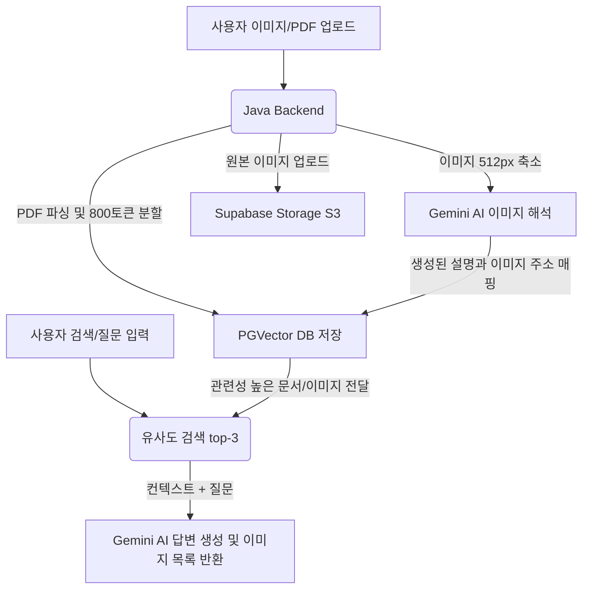

# 📂 AI 파일 & 이미지 RAG 시스템 (PDF & Image RAG) 🚀

이 프로젝트는 **Spring Boot**와 **Spring AI**, **Gemini (Google GenAI)**, 그리고 **Supabase (PostgreSQL + S3 Storage)**를 결합하여 만든 스마트 AI 시스템입니다. 

사용자가 올린 **PDF 문서**에서 답변을 찾거나, **이미지**를 해석하고 의미 기반으로 검색할 수 있는 기능을 제공합니다.

---

## 💡 아주 쉽게 이해하는 RAG (Retrieval-Augmented Generation)

> **"똑똑하지만 최근 정보나 내 개인 문서는 모르는 AI(교수님)에게 책(데이터베이스)을 찾아 전달해 주는 비서"**

* **일반적인 AI**: 엄청 공부를 많이 했지만, 사용자가 개인적으로 가지고 있는 PDF 파일이나 방금 올린 이미지 파일의 내용은 알지 못합니다.
* **RAG (검색 증강 생성)**: 
  1. 사용자가 올린 문서를 컴퓨터가 읽기 쉽게 잘게 쪼개서 보관합니다.
  2. 사용자가 질문("이 PDF에서 가장 중요한 내용이 뭐야?")을 던지면, 관련된 문서 조각들을 데이터베이스에서 먼저 찾아냅니다.
  3. 찾아낸 문서 조각들과 질문을 함께 AI에게 건네주며 **"여기 이 참고 문서들을 읽고 내 질문에 대답해줘"**라고 요청합니다.
  4. AI는 엉뚱한 거짓말(환각 현상)을 하지 않고, 주어진 참고 문서에 기반하여 정확한 답변을 제공합니다.

---

## 🛠️ 주요 핵심 기능

### 1. 📄 PDF RAG (문서 기반 스마트 질의응답)
* **문서 파싱**: PDF 파일을 업로드하면 `PagePdfDocumentReader`를 통해 페이지별로 텍스트를 읽어옵니다.
* **텍스트 쪼개기 (Token Splitting)**: 너무 긴 문서는 AI가 기억하기 힘듭니다. `TokenTextSplitter`를 사용해 약 800 토큰(단어 조각 단위) 크기로 의미 있게 분할합니다.
* **벡터 저장소 저장**: 쪼갠 텍스트 조각들의 '의미'를 숫자로 변환(임베딩)하여 PostgreSQL 데이터베이스(`PgVectorStore`)에 저장합니다.
* **컨텍스트 매칭 답변**: 질문이 들어오면 벡터 데이터베이스에서 의미가 가장 유사한 단락 3개(`topK(3)`)를 찾아냅니다. 이 단락들을 질문과 함께 Gemini AI 모델에 전달하여 신뢰성 높은 답변을 생성합니다.

### 2. 🖼️ 이미지 RAG & 클라우드 저장소 연동
* **이미지 리사이징**: 고화질 이미지는 용량이 커서 네트워크와 AI 처리 비용이 많이 듭니다. `Thumbnailator` 라이브러리를 사용하여 이미지를 512x512 크기로 압축하고 축소합니다.
* **이미지 캡셔닝 (AI 해석)**: 멀티모달 기능이 있는 Gemini AI 모델에 축소된 이미지를 보내 **"이 이미지가 어떤 내용인지 설명해줘"**라고 요청하여 이미지 설명(Caption)을 얻습니다.
* **Supabase Storage (S3) 업로드**: 원본 이미지를 UUID 기반의 중복 없는 파일명으로 변경하여 안전하게 Supabase Storage에 업로드합니다. 이후 웹 브라우저에서 바로 볼 수 있는 Public URL로 변환합니다.
* **이미지 의미 기반 검색**: 이미지 설명(Caption)과 이미지의 Public URL 링크를 함께 벡터 데이터베이스에 저장합니다. 사용자가 텍스트("귀여운 동물 사진")로 검색하면, 그 의미와 가장 잘 맞는 이미지를 찾아서 썸네일과 함께 화면에 보여줍니다.

---

## 🔍 서비스 흐름 보기



---

## ⚙️ 실행 방법 및 주의사항

### 🔒 보안 주의 사항 (필수)
프로젝트 설정 값과 API Key들이 포함되는 **`.env.dev`** 파일은 중요한 개인 정보입니다.
* **절대 GitHub에 커밋하거나 타인에게 공유하지 마세요!**
* `.gitignore` 파일에 `.env*` 패턴이 등록되어 있어 안전하게 관리됩니다.

### 1. 환경 변수 파일 준비
프로젝트 루트 디렉토리에 **`.env.dev`** 파일을 생성하고 아래 양식에 맞추어 본인의 Key 정보를 채워 넣습니다:

```properties
# Supabase PostgreSQL Database 연결 설정
DB_HOST=your-supabase-db-host
DB_NAME=postgres
DB_USERNAME=your-db-username
DB_PASSWORD=your-db-password

# Google Gemini API Key (https://aistudio.google.com/apikey)
GEMINI_API_KEY=your-gemini-api-key

# Supabase Storage S3 설정 (Project Settings -> Storage)
SUPABASE_STORAGE_ENDPOINT=your-supabase-storage-s3-endpoint
SUPABASE_STORAGE_REGION=ap-northeast-2
SUPABASE_STORAGE_ACCESS_KEY=your-supabase-s3-access-key
SUPABASE_STORAGE_SECRET_KEY=your-supabase-s3-secret-key
```

### 2. 프로젝트 빌드 및 실행
```bash
./gradlew bootRun --args='--spring.profiles.active=dev'
```
서버가 켜지면 아래 주소로 접속하여 테스트할 수 있습니다:
* **PDF RAG 테스트**: `http://localhost:8080/pdf`
* **이미지 검색 및 분석 테스트**: `http://localhost:8080/image`
