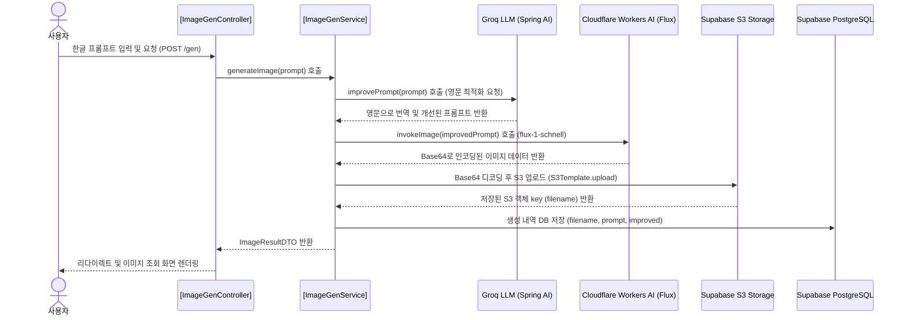

# 🎨 Cloudflare Workers AI & Supabase 이미지 생성 프로젝트 (Imagegen)

이 프로젝트는 Spring Boot를 기반으로 하여 사용자가 한글로 프롬프트를 입력하면, LLM을 통해 프롬프트를 영문으로 최적화(번역/개선)한 뒤 Cloudflare Workers AI를 통해 이미지를 생성하고, 생성된 이미지를 Supabase S3 스토리지에 업로드하고 메타데이터를 Supabase PostgreSQL 데이터베이스에 저장하는 실습 예제 프로젝트입니다.

---

## 🏛️ 서비스 아키텍처 및 이미지 생성 워크플로우

생성 프로세스는 다음과 같은 흐름으로 진행됩니다:



---

## 🚀 주요 기능 및 핵심 컴포넌트

### 1. 프롬프트 최적화 (Groq LLM 연동)
* **목적:** 사용자가 입력한 한국어 프롬프트를 이미지 생성 모델이 이해하기 쉬운 500자 이내의 영어 프롬프트로 변환 및 개선합니다.
* **설정 클래스:** [ImageGenConfig.java](file:///C:/workspace/imagegen/src/main/java/org/example/imagegen/config/ImageGenConfig.java)
  * `ChatModel`을 커스텀하여 `promptImproveClient` 빈(Bean)을 정의하고 시스템 프롬프트 및 파라미터(`temperature(0.3)`)를 구성하였습니다.
* **비즈니스 로직:** [ImageGenService.java](file:///C:/workspace/imagegen/src/main/java/org/example/imagegen/service/ImageGenService.java)의 `improvePrompt()` 메소드에서 번역을 처리합니다.

### 2. 이미지 생성 (Cloudflare Workers AI flux-1-schnell)
* **목적:** 번역 및 최적화된 영어 프롬프트를 기반으로 고품질 이미지를 생성합니다.
* **비즈니스 로직:** [ImageGenService.java](file:///C:/workspace/imagegen/src/main/java/org/example/imagegen/service/ImageGenService.java)의 `invokeImage()` 메소드
  * `RestClient`를 통해 Cloudflare의 AI API(`@cf/black-forest-labs/flux-1-schnell` 모델)를 호출하여 Base64 형태의 이미지 데이터를 획득합니다.
* **설정 클래스:** [ImageGenConfig.java](file:///C:/workspace/imagegen/src/main/java/org/example/imagegen/config/ImageGenConfig.java)의 `cfWorkersAiClient` 빈 등록 부분에서 API 호출 제한 시간(Connection 5초, Read 60초) 및 Bearer Token 인증 헤더 등을 설정하였습니다.

### 3. 이미지 저장 및 조회 (Supabase S3 Storage)
* **목적:** 생성된 Base64 이미지를 저장하기에 영구적이고 가벼운 Supabase S3 스토리지에 업로드하고 다운로드합니다.
* **비즈니스 로직:** [ImageGenService.java](file:///C:/workspace/imagegen/src/main/java/org/example/imagegen/service/ImageGenService.java)의 `upload()` 및 `download()` 메소드
  * Spring Cloud AWS의 `S3Template`을 활용하여 S3 Bucket에 고유한 UUID를 파일명으로 하여 저장합니다.
* **다운로드 엔드포인트:** [ImageGenController.java](file:///C:/workspace/imagegen/src/main/java/org/example/imagegen/controller/ImageGenController.java)의 `/gen/{filename}` GET API를 통해 사용자의 브라우저에 S3로부터 다운로드받은 원본 이미지 스트림을 전송합니다.

### 4. 생성 내역 저장 (JPA & Supabase PostgreSQL)
* **목적:** 사용자가 이전에 생성한 이미지와 프롬프트 이력을 데이터베이스에 영구 보존하여 화면에 그리드 형식으로 보여줍니다.
* **엔티티:** [GenImage.java](file:///C:/workspace/imagegen/src/main/java/org/example/imagegen/entity/GenImage.java)
  * `id`, `filename` (S3 key), `prompt` (사용자 입력 한글 프롬프트), `improved` (최적화된 영어 프롬프트) 필드를 정의했습니다.
* **레포지토리:** [GenImageJpaRepository.java](file:///C:/workspace/imagegen/src/main/java/org/example/imagegen/repository/GenImageJpaRepository.java)

### 5. 사용자 화면 (Thymeleaf MVC)
* **컨트롤러:** [ImageGenController.java](file:///C:/workspace/imagegen/src/main/java/org/example/imagegen/controller/ImageGenController.java)
  * 사용자의 입력 데이터를 검증(`@NotBlank`, `@Size(max = 500)`)하고 에러 처리 및 결과 바인딩을 리다이렉트 시 플래시 어트리뷰트(`RedirectAttributes`)를 활용해 구현했습니다.
* **화면 템플릿:** [page.html](file:///C:/workspace/imagegen/src/main/resources/templates/gen/page.html)
  * 타임리프를 이용해 이미지 생성 폼 작성 및 이전 생성 이력 리스트를 썸네일과 함께 그리드로 출력합니다.

---

## ⚙️ 설정 정보 및 실행 방법

### 1. 환경 변수 구성
로컬 개발 환경에서는 프로젝트 루트 경로에 위치한 [.env.dev.sample](file:///C:/workspace/imagegen/.env.dev.sample) 파일을 복사하여 `.env.dev` 파일을 생성한 후 실제 키 값들로 채워 넣어야 합니다.

```properties
# Supabase DB
DB_HOST=aws-0-ap-northeast-2.pooler.supabase.com
DB_NAME=postgres
DB_USERNAME=postgres.******
DB_PASSWORD=******

# Groq API
GROQ_API_KEY=gsk_******

# Cloudflare Workers AI
CF_ACCOUNT_ID=******
CF_API_TOKEN=************

# Supabase S3 Storage
STORAGE_ENDPOINT=https://******.storage.supabase.co/storage/v1/s3
STORAGE_REGION=ap-northeast-2
STORAGE_ACCESS_KEY=******
STORAGE_SECRET_KEY=************
STORAGE_BUCKET=gen
```

### 2. 빌드 정보 ([build.gradle](file:///C:/workspace/imagegen/build.gradle))
* **Java Version:** 17
* **Framework:** Spring Boot 4.1.0
* **주요 의존성:**
  * Spring AI (`spring-ai-starter-model-openai` - Groq API 연동용)
  * Spring Cloud AWS (`spring-cloud-aws-starter-s3` - Supabase S3 연동용)
  * Spring Boot Starter (Data JPA, Web, Thymeleaf, Validation)
  * PostgreSQL JDBC Driver
  * Lombok

### 3. 활성화 프로필 ([application.yaml](file:///C:/workspace/imagegen/src/main/resources/application.yaml))
* `dev`, `ai`, `file`, `db` 프로필이 함께 활성화되어 작동합니다.
* `dev` 프로필이 활성화되면 루트 경로의 `.env.dev` 환경 변수 속성 파일이 자동으로 import됩니다.
```yaml
spring:
  profiles:
    active: dev,ai,file,db
```

---

> [!NOTE]
> 이 프로젝트는 Spring Boot의 최신 프로필 연동 기법 및 Spring AI 2.0.0 버전, 최신 Spring Cloud AWS 4.1.0을 결합한 클라우드 네이티브 웹 애플리케이션의 훌륭한 실습 템플릿입니다.

<!-- pdf-til-supplement:start -->
## TIL 부연 설명 — PDF와 연결하기

기존 실습 내용을 이해하기 위한 PDF 기반 부연 설명이다. 아래 예시는 개념을 설명하기 위한 것이며, 이 프로젝트에서 실행해 관찰한 결과와는 구분한다. 페이지 번호는 표지를 포함한 PDF 순서다.

함께 읽을 파일: [src/main/java/org/example/imagegen/controller/ImageGenController.java](<../../imagegen/src/main/java/org/example/imagegen/controller/ImageGenController.java>) · [src/main/java/org/example/imagegen/ImagegenApplication.java](<../../imagegen/src/main/java/org/example/imagegen/ImagegenApplication.java>) · [src/main/resources/templates/index.html](<../../imagegen/src/main/resources/templates/index.html>)

### 이미지 생성과 영구 저장의 경계

이미지 생성은 입력 프롬프트를 모델에 보내 결과 바이트를 얻는 과정이고 저장은 그 결과를 이후에도 조회하도록 보관하는 과정이다. 미리보기만 보여 주는 상태와 DB·스토리지에 저장된 상태를 구분해야 새로고침 후 사라지는 현상을 설명할 수 있다.

**예시로 이해하기:** 생성 응답을 받은 뒤 Base64 디코딩 → 크기·형식 확인 → 객체 저장 → 메타데이터 기록으로 나누어 읽는다. 같은 프롬프트도 결과가 달라질 수 있으므로 비교 기록에는 프롬프트뿐 아니라 사용한 모델과 생성 옵션을 함께 남긴다.

근거: 405-3 프롬프트에서 이미지로 — [6쪽](<../../260629_ex/새 폴더/8-10/405-3_프롬프트에서_이미지로.pdf#page=6>) · [7쪽](<../../260629_ex/새 폴더/8-10/405-3_프롬프트에서_이미지로.pdf#page=7>) · [8쪽](<../../260629_ex/새 폴더/8-10/405-3_프롬프트에서_이미지로.pdf#page=8>) · [15쪽](<../../260629_ex/새 폴더/8-10/405-3_프롬프트에서_이미지로.pdf#page=15>)

### 객체 키와 접근 URL을 나누어 보관하기

객체 스토리지는 버킷 안의 키로 파일을 찾는다. DB에 만료되는 서명 URL보다 안정적인 객체 키를 보관하면 제공 방식과 저장 위치를 바꾸기 쉽다. FileStore 같은 인터페이스는 로컬 저장과 객체 스토리지 구현의 차이를 서비스 밖으로 분리한다.

**예시로 이해하기:** 비공개 파일은 로그인 사용자와 파일 소유 관계를 확인한 뒤 읽기 경로를 제공한다. 스토리지 업로드와 DB 트랜잭션은 별개라 DB가 롤백되어도 업로드한 객체는 남을 수 있다. 보상 삭제나 정리 작업이 필요한 실패 구간을 표시한다.

근거: 404-2 객체 스토리지로 파일 저장하기 — [5쪽](<../../260629_ex/새 폴더/8-7/404-2_객체_스토리지로_파일_저장하기.pdf#page=5>) · [27쪽](<../../260629_ex/새 폴더/8-7/404-2_객체_스토리지로_파일_저장하기.pdf#page=27>) · [28쪽](<../../260629_ex/새 폴더/8-7/404-2_객체_스토리지로_파일_저장하기.pdf#page=28>) · [35쪽](<../../260629_ex/새 폴더/8-7/404-2_객체_스토리지로_파일_저장하기.pdf#page=35>) · [41쪽](<../../260629_ex/새 폴더/8-7/404-2_객체_스토리지로_파일_저장하기.pdf#page=41>) · [46쪽](<../../260629_ex/새 폴더/8-7/404-2_객체_스토리지로_파일_저장하기.pdf#page=46>)

<!-- pdf-til-supplement:end -->
