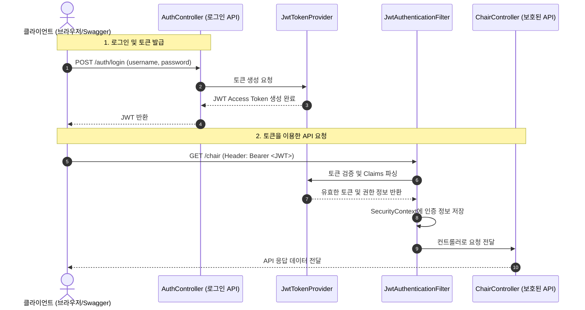

# 🔒 Spring Boot REST Security & JWT 실습 프로젝트 (rest-sec)

본 프로젝트는 Spring Boot 환경에서 **Spring Security**와 **JWT (JSON Web Token)**를 활용하여 REST API 보안 및 인증 체계를 단계별로 구축한 실습 저장소입니다.

---

## 🛠️ 기술 스택
- **Framework**: Spring Boot 3.x, Spring Security 6.x
- **Database / ORM**: Spring Data JPA
- **Authentication**: JWT (JJWT 0.13.0)
- **API Documentation**: Springdoc OpenAPI (Swagger UI)

---

## 📂 프로젝트 패키지 구조
```text
src/main/java/org/example/restsec/
├── RestSecApplication.java        # 애플리케이션 진입점
├── auth/
│   ├── JwtAuthenticationFilter.java    # JWT 요청 인증 필터
│   ├── JwtProperties.java              # JWT 속성 바인딩
│   ├── JwtTokenProvider.java          # JWT 토큰 생성 및 검증 제공자
│   ├── RestAccessDeniedHandler.java    # 403 Forbidden 예외 처리기
│   └── RestAuthenticationEntryPoint.java # 401 Unauthorized 예외 처리기
├── config/
│   ├── JpaConfig.java                  # JPA Auditing 설정
│   ├── SecurityConfig.java             # Spring Security 및 CORS/CSRF 필터 체인 설정
│   └── SwaggerUIConfig.java            # OpenAPI / Swagger UI Bearer Auth 연동 설정
├── controller/
│   ├── AuthController.java             # JWT 발급을 위한 로그인 REST API 컨트롤러
│   └── ChairController.java            # 의자 정보 CRUD REST 컨트롤러 (보호된 API)
├── entity/
│   ├── BaseEntity.java                 # JPA Auditing 기반 공통 등록/수정 시간 필드
│   └── ChairEntity.java                # 의자 도메인 JPA 엔티티
├── repository/
│   └── ChairJpaRepository.java         # 의자 JPA 리포지토리 인터페이스
└── service/
    └── ChairService.java               # 의자 CRUD 비즈니스 로직 서비스
```

---

## 💡 주요 단계별 구현 내용

### 1단계: 기본 도메인 설계 및 JPA 설정
* **JPA Auditing**: [`BaseEntity.java`](file:///C:/workspace/rest-sec/src/main/java/org/example/restsec/entity/BaseEntity.java)를 설계하고 [`JpaConfig.java`](file:///C:/workspace/rest-sec/src/main/java/org/example/restsec/config/JpaConfig.java)를 통해 `@EnableJpaAuditing`을 활성화하여 생성일(`createdAt`)과 수정일(`modifiedAt`)을 자동으로 추적하도록 설정했습니다.
* **도메인 CRUD**: [`ChairEntity.java`](file:///C:/workspace/rest-sec/src/main/java/org/example/restsec/entity/ChairEntity.java), [`ChairJpaRepository.java`](file:///C:/workspace/rest-sec/src/main/java/org/example/restsec/repository/ChairJpaRepository.java), 그리고 [`ChairService.java`](file:///C:/workspace/rest-sec/src/main/java/org/example/restsec/service/ChairService.java) 레이어를 작성해 CRUD 비즈니스 로직을 구축하였습니다.

### 2단계: Spring Security 기본 설정 및 CORS/CSRF
* **CSRF 비활성화**: REST API의 무상태성을 고려해 CSRF 보안 설정을 비활성화했습니다.
* **CORS 설정**: 외부 도메인(`http://127.0.0.1:5500`)에서의 API 접근을 허용하도록 [`SecurityConfig.java`](file:///C:/workspace/rest-sec/src/main/java/org/example/restsec/config/SecurityConfig.java) 내부에 `CorsConfigurationSource` Bean을 정의하고 설정했습니다.
* **정적 리소스 및 경로 허용**: 프론트엔드 테스트를 위한 정적 페이지 경로와 Swagger UI 관련 경로를 인증 예외(`permitAll()`) 경로로 지정했습니다.

### 3단계: HTTP Basic 인증 & 예외 처리 커스터마이징
* **HTTP Basic Auth**: 인증 실패 시 기본 HTML 로그인 폼 대신 REST 응답에 맞춘 에러를 출력하기 위해 HTTP Basic 인증을 비활성화하고, 커스텀 예외 핸들러를 도입했습니다.
* **401 Unauthorized**: 인증에 실패해 접근 권한을 획득하지 못했을 경우 JSON 형태의 에러 응답을 반환하는 [`RestAuthenticationEntryPoint.java`](file:///C:/workspace/rest-sec/src/main/java/org/example/restsec/auth/RestAuthenticationEntryPoint.java)를 구현하였습니다.
* **403 Forbidden**: 필요한 권한이 없는 자원에 접근(예: DELETE 요청 시 ADMIN 권한 검증 실패 등)할 경우 처리하는 [`RestAccessDeniedHandler.java`](file:///C:/workspace/rest-sec/src/main/java/org/example/restsec/auth/RestAccessDeniedHandler.java)를 연동하였습니다.

### 4단계: JWT 기반 인증 체계 전환
* **JJWT 라이브러리 연동**: JWT 처리를 위해 `jjwt-api`, `jjwt-impl`, `jjwt-jackson` 의존성(0.13.0 버전)을 추가했습니다.
* **JwtProperties 설정 분리**: 보안을 위해 JWT 서명 비밀 키와 토큰 유효 기간 설정을 `application-jwt.yaml`로 분리하고, [`JwtProperties.java`](file:///C:/workspace/rest-sec/src/main/java/org/example/restsec/auth/JwtProperties.java) 클래스에서 `@ConfigurationProperties`를 사용해 가져오도록 설정했습니다.
* **JwtTokenProvider 구현**:
  * [`JwtTokenProvider.java`](file:///C:/workspace/rest-sec/src/main/java/org/example/restsec/auth/JwtTokenProvider.java)는 사용자 식별자 및 역할을 포함하는 JWT Access Token 생성 및 검증 로직을 포함합니다.
* **로그인 API 및 Filter 연동**:
  * [`AuthController.java`](file:///C:/workspace/rest-sec/src/main/java/org/example/restsec/controller/AuthController.java)에서 사용자 인증 후 성공 시 JWT 토큰을 발급하는 `/auth/login` 엔드포인트를 제공합니다.
  * [`JwtAuthenticationFilter.java`](file:///C:/workspace/rest-sec/src/main/java/org/example/restsec/auth/JwtAuthenticationFilter.java)를 구현하여 요청 헤더(`Authorization: Bearer <TOKEN>`)에서 토큰을 파싱하고, 검증이 성공할 경우 `SecurityContextHolder`에 인증 객체를 주입하여 요청 당 1회 인증 프로세스가 수행되도록 설계했습니다.

---

## 🔄 JWT 인증 흐름 (Authentication Flow)



---

## 🚀 실행 및 테스트 방법

### 1. Swagger UI 접속
* 애플리케이션 실행 후 `http://localhost:8080/swagger-ui.html`에 접속합니다.

### 2. 로그인 및 토큰 발급
* [`AuthController.java`](file:///C:/workspace/rest-sec/src/main/java/org/example/restsec/controller/AuthController.java)의 `/auth/login` API를 호출하여 JWT를 발급받고 복사합니다.

### 3. 인증 토큰 적용
* Swagger UI 우측 상단의 **Authorize** 버튼을 클릭한 후 복사한 토큰을 `bearerAuth` 필드에 입력하여 적용합니다.

### 4. 보호된 API 호출
* `/chair` 등의 엔드포인트에 요청을 전송해 권한에 따라 정상 처리되는지 확인합니다.
