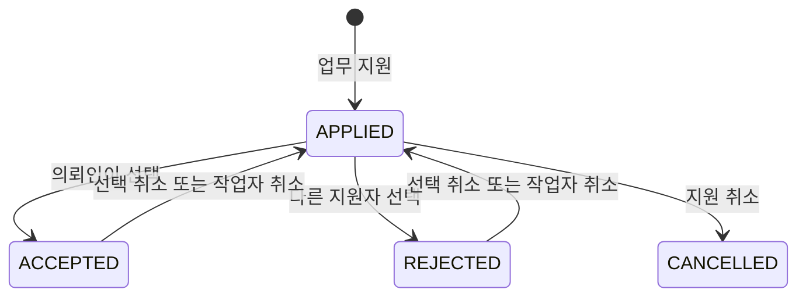

# BaroHae - 긴급 업무 매칭 플랫폼 프로젝트 회고와 구현 기록

> **Spring Boot 기반 24시간 이내 긴급 업무 매칭 플랫폼**을 팀으로 구현하며, 지원자 선택·업무 상태 관리·소셜 로그인·배포까지 경험한 프로젝트 기록입니다.

## 1. 프로젝트 개요

**BaroHae(바로해)**는 발표 자료 보완, 문서 검토·번역, 개발 등 빠른 처리가 필요한 일을 의뢰인과 작업자에게 연결하는 플랫폼이다. 보상은 현금 대신 시간 단위의 **품**으로 관리한다.

| 구분 | 내용 |
| --- | --- |
| 기록 기간 | 2026.08.20 ~ 2026.09.03 |
| 백엔드 | Java 17, Spring Boot, Spring MVC, Spring Data JPA |
| 화면 | Thymeleaf, CSS |
| 인증 | Spring Security, Form Login, Kakao·Google OAuth2 |
| 데이터·파일 | PostgreSQL(Supabase), Flyway, Supabase Storage |
| 실시간·AI | STOMP WebSocket, Spring AI, Google Gemini |
| 배포 | Gradle, Docker, Render |

## 2. 내가 집중한 기능

프로젝트에서 가장 크게 맡은 영역은 **지원자 비교와 작업자 선택 흐름**이었다. 단순히 지원 정보를 저장하는 것에서 끝나지 않고, 사용자가 취소하거나 의뢰인이 선택을 바꾸는 상황까지 고려해 업무 상태가 일관되게 유지되도록 구현했다.

또한 업무 취소와 품 이력, 리뷰 노출, 카카오·구글 로그인, Render 배포 설정, 오류 처리와 조회 성능 개선 작업을 진행했다. 기능을 추가할 때는 화면만 연결하기보다 권한, 예외 상황, 관련 테스트가 함께 바뀌는지 확인하는 습관을 들이려 했다.

## 3. 가장 많이 배운 점

### 업무 매칭은 상태 전이로 설계해야 한다

지원 상태를 `APPLIED`, `ACCEPTED`, `REJECTED`, `CANCELLED`로 분리했다. 의뢰인이 한 명을 선택하면 해당 지원자는 `ACCEPTED`, 나머지는 `REJECTED`가 되고 업무에는 작업자가 배정된다. 이때 작업자와 의뢰인이 대화할 수 있도록 채팅방도 생성한다.



상태를 나누니 다음 규칙을 서비스 계층에서 명확히 둘 수 있었다.

- 모집 중(`OPEN`)인 업무에만 지원할 수 있다.
- 의뢰인은 자신의 업무에 지원할 수 없다.
- 이미 지원 중이거나 선택된 지원은 중복 지원할 수 없다.
- 선택된 작업자가 취소하면 업무 배정을 해제하고 채팅방을 정리하며, 다른 지원자에게 다시 지원 가능한 상태를 제공한다.

특히 동시 요청을 고려해 업무를 조회할 때 비관적 잠금을 사용했다. ‘마지막 한 명을 선택하는’ 행위처럼 여러 요청이 같은 업무를 바꿀 수 있는 곳에서는 화면의 조건문만 믿지 않고, 서버와 DB에서 상태를 다시 검증해야 함을 배웠다.

### 중복 요청을 막는 방식은 사용자 경험에도 영향을 준다

지원 취소 후 다시 지원하는 경우, 기존 지원 데이터를 무조건 새로 만들지 않고 상태를 다시 `APPLIED`로 되돌렸다. 이미 처리된 지원을 재요청했을 때는 충돌 응답을 반환한다. 이렇게 하면 중복 데이터가 쌓이는 것을 줄이고, 사용자는 자신의 현재 지원 상태를 예측할 수 있다.

업무가 만료되거나 의뢰인이 취소하는 흐름에서는 예약된 품을 반환하고, 거래 이력을 남기도록 연결했다. 숫자만 증감시키는 것보다 **변경 사유와 관련 업무를 기록**해야 나중에 사용자가 자신의 잔액 변화를 이해하고 운영자가 문제를 추적할 수 있다는 점이 인상적이었다.

### 인증은 화면 숨김만으로 끝나지 않는다

지원자 비교 기능은 업무 등록자에게만 보이게 했고, 서버에서도 의뢰인인지 확인한 뒤 작업자 선택을 처리했다. 관리자 경로는 Spring Security에서 `ROLE_ADMIN` 권한을 요구하도록 분리했다.

카카오와 구글 OAuth2 로그인도 연동했다. OAuth 제공자별 사용자 정보를 같은 방식으로 다룰 수 있도록 서비스로 분리하고, 소셜 로그인 설정이 없는 환경에서도 애플리케이션이 불필요하게 실패하지 않도록 방어했다. 또한 WebSocket 메시지는 인증된 사용자에게만 전달되도록 보완했다.

### 기능을 만들 때 배포 환경도 함께 확인해야 한다

로컬에서만 동작하는 코드는 서비스가 아니다. Dockerfile과 Render 설정을 추가해 Java 애플리케이션을 컨테이너로 배포할 수 있게 했고, DB·AI 설정은 프로필과 환경 변수로 분리했다.

```text
Browser
  → Spring MVC / Thymeleaf
  → Service (업무·지원·정산 정책)
  → JPA / PostgreSQL on Supabase
  → Supabase Storage (첨부 파일)

Browser ↔ STOMP WebSocket ↔ ChatService
Spring AI ↔ Google Gemini
```

파일 업로드는 업무의 외부 참고 링크와 분리해 관리했다. 비공개 버킷에 저장한 뒤 권한을 확인한 사용자에게만 서명 URL을 발급하는 방식으로, 파일 경로 자체를 공개하지 않도록 구성했다.

## 4. 트러블슈팅과 개선한 점

| 문제 | 대응 | 배운 점 |
| --- | --- | --- |
| 지원 취소·재지원 시 데이터가 중복될 수 있음 | 기존 지원 상태를 확인해 재활성화하거나 충돌 응답 처리 | 쓰기 요청은 항상 멱등성과 중복을 검토한다. |
| 선택된 작업자가 취소하면 업무와 채팅 상태가 어긋날 수 있음 | 작업자 배정 해제, 채팅방 정리, 후보 상태 복원을 하나의 흐름으로 처리 | 연관된 도메인 변경은 트랜잭션 경계를 함께 설계한다. |
| 설정 없는 환경에서 AI 클라이언트 생성이 실패할 수 있음 | AI 모델 설정과 클라이언트 생성을 조건부로 처리 | 선택 기능은 기본 기능의 기동을 막지 않아야 한다. |
| 목록 조회가 늘면서 화면 응답이 무거워질 수 있음 | 필요한 연관 데이터를 고려해 조회 쿼리와 화면용 모델을 보완 | 기능 완료 뒤에도 조회 경로를 점검해야 한다. |

## 5. 다음 프로젝트에 적용할 점

이번에는 기능을 구현하며 예외 흐름을 보완하는 일이 많았다. 다음 프로젝트에서는 구현 전에 상태 전이표와 권한 매트릭스를 먼저 작성하고, 핵심 시나리오를 테스트로 고정하고 싶다.

- 업무·지원·정산처럼 상태가 변하는 도메인은 화면보다 먼저 상태와 불변 조건을 정리한다.
- 정상 흐름뿐 아니라 취소, 중복 클릭, 권한 없는 접근, 만료를 테스트 케이스에 포함한다.
- PR 단위로 기능 설명, DB 변경, 환경 변수, 테스트 결과를 함께 기록한다.
- 배포 환경에서 필요한 설정을 초기에 확인하고, 민감한 값은 저장소가 아닌 환경 변수로 관리한다.

## 6. 회고

이번 프로젝트를 통해 CRUD 화면을 만드는 것과 실제 서비스 흐름을 안전하게 연결하는 일은 다르다는 것을 배웠다. 특히 지원자 선택, 취소, 품 반환처럼 하나의 행동이 여러 데이터와 화면에 영향을 주는 기능을 구현하면서, 정책을 코드로 명확히 표현하는 경험을 했다.

앞으로는 기능 수를 늘리는 데 그치지 않고, 상태 일관성·권한·예외 처리·테스트와 운영 환경까지 함께 설계하는 백엔드 개발자가 되고 싶다.

<!-- pdf-til-supplement:start -->
## TIL 부연 설명 — PDF와 연결하기

기존 실습 내용을 이해하기 위한 PDF 기반 부연 설명이다. 아래 예시는 개념을 설명하기 위한 것이며, 이 프로젝트에서 실행해 관찰한 결과와는 구분한다. 페이지 번호는 표지를 포함한 PDF 순서다.

함께 읽을 파일: [src/main/java/org/example/_nd_project/Application.java](<../../2nd_project/src/main/java/org/example/_nd_project/Application.java>) · [src/main/java/org/example/_nd_project/Controller/AdminController.java](<../../2nd_project/src/main/java/org/example/_nd_project/Controller/AdminController.java>) · [src/main/java/org/example/_nd_project/Controller/AuthController.java](<../../2nd_project/src/main/java/org/example/_nd_project/Controller/AuthController.java>)

### MVC와 계층형 설계의 역할 차이

MVC는 입력 제어·데이터·화면의 역할을 나누고, 계층형 설계는 웹 처리·업무 규칙·저장소 접근의 책임을 나눈다. 따라서 MVC와 Controller–Service–Repository 구조를 함께 사용할 수 있다. 클린 아키텍처에서는 업무 규칙이 외부 구현을 직접 참조하지 않도록 의존 방향을 조정한다.

**예시로 이해하기:** 컨트롤러는 “요청이 어떤 형식인가”, 서비스는 “이 작업이 허용되는가”, 저장소는 “어떻게 읽고 쓰는가”를 맡도록 생각한다. 외부 AI 제공자를 교체할 때 요청 API까지 바꿔야 한다면 제공자 전용 타입이 경계를 넘는지 살펴본다.

근거: 232 소프트웨어 아키텍처 패턴 — [4쪽](<../../260629_ex/새 폴더/7-2/232_소프트웨어_아키텍처_패턴.pdf#page=4>) · [12쪽](<../../260629_ex/새 폴더/7-2/232_소프트웨어_아키텍처_패턴.pdf#page=12>) · [15쪽](<../../260629_ex/새 폴더/7-2/232_소프트웨어_아키텍처_패턴.pdf#page=15>) · [19쪽](<../../260629_ex/새 폴더/7-2/232_소프트웨어_아키텍처_패턴.pdf#page=19>)

### 역할 권한과 작성자 권한을 함께 검사하기

역할 기반 접근 제어는 회원·관리자 같은 사용자 범주의 권한을 정한다. 작성자 검사는 특정 게시글과 현재 사용자의 관계를 확인한다. “회원이면 수정 API 호출 가능”이라는 경로 규칙만으로 다른 회원의 글 수정을 막을 수는 없다.

**예시로 이해하기:** 수정할 글의 ID는 요청에서 받고 사용자 ID는 검증된 인증 주체에서 얻는다. 서버가 읽은 글의 작성자와 비교한 뒤 수정한다. 화면 버튼 표시, API 접근 규칙, 서비스의 소유권 검사가 각각 맡는 범위를 나누어 기록한다.

근거: 412-2 역할 기반 인가와 작성자 권한 검증 — [7쪽](<../../260629_ex/새 폴더/8-12/412-2_역할_기반_인가와_작성자_권한_검증.pdf#page=7>) · [18쪽](<../../260629_ex/새 폴더/8-12/412-2_역할_기반_인가와_작성자_권한_검증.pdf#page=18>) · [40쪽](<../../260629_ex/새 폴더/8-12/412-2_역할_기반_인가와_작성자_권한_검증.pdf#page=40>) · [41쪽](<../../260629_ex/새 폴더/8-12/412-2_역할_기반_인가와_작성자_권한_검증.pdf#page=41>) · [44쪽](<../../260629_ex/새 폴더/8-12/412-2_역할_기반_인가와_작성자_권한_검증.pdf#page=44>)

### 업로드 파일·DB 메타데이터·조회 URL

파일 업로드는 일반 문자열 폼과 달리 multipart 요청으로 바이트를 전달한다. 원본 파일명은 표시용 메타데이터로 보관하고 저장 이름은 충돌과 경로 문제를 피하도록 별도로 정한다. 확장자와 Content-Type은 클라이언트가 보낼 수 있는 값이므로 그것만으로 내용을 신뢰하지 않는다.

**예시로 이해하기:** 컨트롤러 수신 → 크기·형식 검사 → 파일 저장 → DB 메타데이터 기록 → 조회 URL 제공으로 추적한다. DB 행 삭제나 orphanRemoval이 디스크 파일까지 자동으로 지워 주지는 않는다. 파일 저장 성공 후 DB 저장이 실패하는 경우의 정리 책임도 필요하다.

근거: 404-1 파일 다루기 — [7쪽](<../../260629_ex/새 폴더/8-7/404-1_파일_다루기.pdf#page=7>) · [12쪽](<../../260629_ex/새 폴더/8-7/404-1_파일_다루기.pdf#page=12>) · [15쪽](<../../260629_ex/새 폴더/8-7/404-1_파일_다루기.pdf#page=15>) · [20쪽](<../../260629_ex/새 폴더/8-7/404-1_파일_다루기.pdf#page=20>) · [34쪽](<../../260629_ex/새 폴더/8-7/404-1_파일_다루기.pdf#page=34>) · [48쪽](<../../260629_ex/새 폴더/8-7/404-1_파일_다루기.pdf#page=48>)

<!-- pdf-til-supplement:end -->
