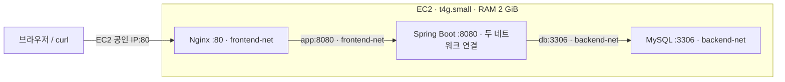

# AWS EC2 Docker Compose 배포와 Nginx 리버스 프록시

> **2026-09-15** · AWS EC2 · Docker Compose · Nginx · Spring Boot · MySQL
>
> 기존 README 코드와 「07-2 AWS EC2 Docker Compose 배포와 Nginx 리버스 프록시」 PDF(본문 25쪽, 부록 15쪽)를 통합한 학습 기록이다. 아래 응답과 상태는 검증 기준이며, 문서 정리 중 실제 AWS 배포를 실행한 결과는 아니다.

## 목차

1. [오늘 배운 핵심과 구조](#1-오늘-배운-핵심과-구조)
2. [로컬에서 AWS와 EC2 준비](#2-로컬에서-aws와-ec2-준비)
3. [EC2에서 Docker와 Nginx 준비](#3-ec2에서-docker와-nginx-준비)
4. [구성 A: Aiven DB](#4-구성-a-aiven-db)
5. [구성 B: MySQL 컨테이너](#5-구성-b-mysql-컨테이너)
6. [환경변수와 시작 순서](#6-환경변수와-시작-순서)
7. [접속 및 메모리 검증](#7-접속-및-메모리-검증)
8. [중지·재개와 데이터 보존](#8-중지재개와-데이터-보존)
9. [PDF 부록: HTTPS와 라우팅](#9-pdf-부록-https와-라우팅)
10. [문제 해결과 복습](#10-문제-해결과-복습)
11. [자료 보완과 출처](#11-자료-보완과-출처)

## 1. 오늘 배운 핵심과 구조

- Compose는 여러 컨테이너의 실행 설정, 네트워크, 저장소, 자원 제한을 함께 관리한다.
- Nginx만 호스트의 `80` 포트에 연결하고 App과 DB는 내부 네트워크로 통신한다.
- 같은 Compose 네트워크에서는 `app`, `db` 같은 서비스 이름을 호스트명으로 사용한다.
- 보안 그룹의 포트 허용과 Docker의 포트 공개는 다른 설정이다.
- 컨테이너 시작, 애플리케이션 준비 완료, 데이터 보존을 각각 확인해야 한다.



| 계층 | 역할 | 네트워크 | 호스트 포트 공개 |
| --- | --- | --- | --- |
| Web: Nginx | HTTP 요청 접수, 리버스 프록시 | `frontend-net` | `80:80` |
| App: Spring Boot | 비즈니스 로직, DB 연동 | 두 네트워크 모두 | 없음 |
| DB: MySQL | 데이터 저장 | `backend-net` | 없음 |

Nginx와 DB는 같은 네트워크를 공유하지 않는다. App은 HTTP 요청을 처리하고 별도의 JDBC 연결로 DB에 접근한다. 네트워크 분리는 `internal: true`로 외부 통신까지 차단한 설정과는 다르다.

### 두 가지 DB 구성

| 구분 | Aiven | MySQL 컨테이너 |
| --- | --- | --- |
| 경로 | Nginx → App → 외부 DB | Nginx → App → 내부 DB |
| Compose 파일 | `compose.yml` | `compose-mysql.yml` |
| 환경변수 파일 | `.env.aiven` | `.env.mysql` |
| EC2 컨테이너 수 | 2개 | 3개 |
| DB 주소 | Aiven 호스트와 포트 | `db:3306` |
| 데이터 위치 | 외부 서비스 | EC2의 `./mysql-data` |

두 구성은 **선택해서 실행**한다. 프로젝트 이름과 호스트 `80` 포트가 같으므로 전환 전 기존 구성을 `down`한다.

## 2. 로컬에서 AWS와 EC2 준비

**실행 위치: 로컬 Git Bash 또는 Bash.** `export`, `$(...)`, 줄 끝의 `\`는 Bash 문법이다. PowerShell에 그대로 붙여 넣지 않는다. AWS CLI와 실습용 SSO 계정이 준비되어 있다고 가정한다.

### 2-1. 식별자와 SSO 로그인

```bash
export STUDENT_ID="studentXX" # 배정받은 ID로 변경
export AWS_PROFILE="$STUDENT_ID"
export AWS_REGION="ap-northeast-2"
export AWS_PAGER=""
export MY_KEY_NAME="${STUDENT_ID}-key"
export MY_SG_NAME="${STUDENT_ID}-web-sg"
export MY_INSTANCE_NAME="${STUDENT_ID}-compose-ec2"

# 프로필 최초 설정
aws configure sso --profile "$AWS_PROFILE"

# 세션 로그인 및 계정 확인
aws sso login --profile "$AWS_PROFILE"
aws sts get-caller-identity
```

| SSO 입력 항목 | 값 |
| --- | --- |
| Session name | `infra-training` |
| Start URL | 교육 담당자가 제공한 SSO URL |
| SSO region | `ap-northeast-2` |
| Registration scopes | `sso:account:access` |
| CLI default region / output | `ap-northeast-2` / `json` |
| Profile name | 본인의 `studentXX` |

`export`는 현재 셸과 자식 프로세스에 적용된다. 새 터미널에서는 다시 설정한다. 리소스의 `Name`, `Owner`, `Course` 태그는 공용 계정에서 내 자원을 구분하는 데 사용한다.

### 2-2. SSH 키 페어

```bash
# 로컬 파일과 AWS에 동일 이름의 키가 없는 최초 생성 시에만 실행
aws ec2 create-key-pair --key-name "$MY_KEY_NAME" \
  --tag-specifications "ResourceType=key-pair,Tags=[{Key=Name,Value=$MY_KEY_NAME},{Key=Course,Value=infra-training},{Key=Owner,Value=$STUDENT_ID}]" \
  --query "KeyMaterial" --output text > "./$MY_KEY_NAME.pem"
chmod 400 "./$MY_KEY_NAME.pem"
ls -l "./$MY_KEY_NAME.pem"
```

`chmod 400`은 소유자 읽기 전용 권한이다. Windows에서는 SSH 클라이언트에 따라 파일 ACL 조정이 필요할 수 있다. `.pem`은 Git에 올리지 않는다.

기존 키는 재사용한다. 원본의 키 삭제·재발급 명령은 기본 절차에서 제외했다. **같은 이름으로 키를 다시 만들어도 기존 EC2의 로그인 키는 교체되지 않는다.** 키를 잃었다면 기존 인스턴스의 접근 복구와 새 인스턴스용 키 발급을 구분한다.

### 2-3. 보안 그룹

기본 VPC와 인터넷에 연결되는 기본 서브넷을 사용하는 실습이다. VPC 조회 결과가 `None`이면 네트워크 구성을 먼저 확인한다.

```bash
export VPC_ID=$(aws ec2 describe-vpcs \
  --filters "Name=is-default,Values=true" \
  --query "Vpcs[0].VpcId" --output text)

export MY_SG_ID=$(aws ec2 describe-security-groups \
  --filters "Name=group-name,Values=$MY_SG_NAME" "Name=vpc-id,Values=$VPC_ID" \
  --query "SecurityGroups[0].GroupId" --output text)

if [ "$MY_SG_ID" = "None" ]; then
  export MY_SG_ID=$(aws ec2 create-security-group \
    --group-name "$MY_SG_NAME" --vpc-id "$VPC_ID" \
    --description "Security Group for Docker Compose Practice" \
    --tag-specifications "ResourceType=security-group,Tags=[{Key=Name,Value=$MY_SG_NAME},{Key=Course,Value=infra-training},{Key=Owner,Value=$STUDENT_ID}]" \
    --query "GroupId" --output text)
fi
echo "보안 그룹 ID: $MY_SG_ID"

export MY_IP=$(curl -fsS https://checkip.amazonaws.com)
aws ec2 authorize-security-group-ingress --group-id "$MY_SG_ID" \
  --protocol tcp --port 22 --cidr "$MY_IP/32"
aws ec2 authorize-security-group-ingress --group-id "$MY_SG_ID" \
  --protocol tcp --port 80 --cidr 0.0.0.0/0

aws ec2 describe-security-groups --group-ids "$MY_SG_ID" \
  --query "SecurityGroups[0].IpPermissions[].{Port:FromPort,Cidr:IpRanges[0].CidrIp}" --output table
```

SSH `22`는 내 IP만, HTTP `80`은 외부 요청을 허용한다. 같은 규칙을 재등록하면 중복 오류가 날 수 있다. PDF의 `8080` 허용은 포트 미공개를 확인하는 대조 실험용이며 기본 배포에는 필요하지 않다.

### 2-4. EC2 생성과 접속

먼저 기존 인스턴스를 확인한다. 재사용할 때는 해당 ID를 `INSTANCE_ID`에 넣고 신규 생성은 생략한다.

```bash
aws ec2 describe-instances \
  --filters "Name=tag:Name,Values=$MY_INSTANCE_NAME" "Name=tag:Owner,Values=$STUDENT_ID" \
    "Name=instance-state-name,Values=pending,running,stopping,stopped" \
  --query "Reservations[].Instances[].[InstanceId,InstanceType,State.Name]" --output table

# 신규 인스턴스가 필요할 때만 실행
export AMI_ID=$(aws ssm get-parameter \
  --name /aws/service/canonical/ubuntu/server/26.04/stable/current/arm64/hvm/ebs-gp3/ami-id \
  --query "Parameter.Value" --output text)

export INSTANCE_ID=$(aws ec2 run-instances \
  --image-id "$AMI_ID" --instance-type t4g.small \
  --key-name "$MY_KEY_NAME" --security-group-ids "$MY_SG_ID" \
  --tag-specifications "ResourceType=instance,Tags=[{Key=Name,Value=$MY_INSTANCE_NAME},{Key=Course,Value=infra-training},{Key=Owner,Value=$STUDENT_ID}]" \
  --query "Instances[0].InstanceId" --output text)

aws ec2 wait instance-running --instance-ids "$INSTANCE_ID"
aws ec2 wait instance-status-ok --instance-ids "$INSTANCE_ID"

export PUBLIC_IP=$(aws ec2 describe-instances --instance-ids "$INSTANCE_ID" \
  --query "Reservations[0].Instances[0].PublicIpAddress" --output text)
echo "인스턴스: $INSTANCE_ID / 공인 IP: $PUBLIC_IP"

ssh -i "./$MY_KEY_NAME.pem" -o StrictHostKeyChecking=accept-new ubuntu@"$PUBLIC_IP"
```

ARM64 기반 인스턴스이므로 AMI와 이미지도 ARM64를 지원해야 한다. AMI ID는 Canonical의 SSM 경로로 조회한다. [Ubuntu AMI 조회 문서](https://ubuntu.com/aws/docs/aws-how-to/instances/find-ubuntu-images/)

## 3. EC2에서 Docker와 Nginx 준비

**이제부터 실행 위치: SSH로 접속한 EC2의 Bash.** 로컬 환경변수는 SSH 접속만으로 원격에 전달되지 않는다.

### Docker 설치

```bash
uname -m
free -h | head -2

# 실습용 설치 스크립트
curl -fsSL https://get.docker.com -o get-docker.sh
sudo sh get-docker.sh
sudo systemctl is-active docker
sudo docker --version
sudo docker compose version

mkdir -p ~/compose-lab
cd ~/compose-lab
```

아키텍처 `aarch64`, 메모리 약 2 GiB, Docker 서비스 `active`를 확인한다. 이후 파일과 Compose 명령은 모두 `~/compose-lab`에서 다룬다. Docker 소켓 접근 권한을 고려해 `sudo docker`를 사용한다.

### 공통 파일: `nginx.conf`

`vi nginx.conf`로 열고 아래 내용을 저장한다. `i`로 입력 → `Esc` → `:wq` → Enter로 저장·종료한다.

```nginx
events {
    worker_connections 1024;
}

http {
    server {
        listen 80;

        location / {
            proxy_pass http://app:8080;
            proxy_set_header Host $host;
            proxy_set_header X-Real-IP $remote_addr;
            proxy_set_header X-Forwarded-For $proxy_add_x_forwarded_for;
        }
    }
}
```

| 설정 | 의미 |
| --- | --- |
| `listen 80` | Nginx 컨테이너의 HTTP 수신 포트 |
| `proxy_pass` | 같은 네트워크의 `app:8080`으로 요청 전달 |
| `Host` | 요청 호스트 정보 전달 |
| `X-Real-IP` | Nginx가 관측한 클라이언트 주소 전달 |
| `X-Forwarded-For` | 기존 헤더에 관측한 주소를 추가 |
| 마운트의 `:ro` | 컨테이너에서 읽기 전용으로 사용 |

컨테이너 안의 `localhost`는 자신이므로 Nginx에서 App에 접근할 때 사용하지 않는다. IP 헤더를 보안 판단에 쓰려면 신뢰할 프록시 범위도 설정해야 한다.

## 4. 구성 A: Aiven DB

### `.env.aiven`

[Aiven 콘솔](https://console.aiven.io/)의 접속 정보로 자리표시자를 바꾼다.

```dotenv
SPRING_DATASOURCE_URL=jdbc:mysql://YOUR_AIVEN_HOST:YOUR_AIVEN_PORT/defaultdb?sslMode=REQUIRED
SPRING_DATASOURCE_USERNAME=avnadmin
SPRING_DATASOURCE_PASSWORD=REPLACE_WITH_AIVEN_PASSWORD
SPRING_JPA_HIBERNATE_DDL_AUTO=validate
SPRING_DATASOURCE_HIKARI_INITIALIZATIONFAILTIMEOUT=-1
SPRING_DATASOURCE_HIKARI_CONNECTIONTIMEOUT=30000
```

`validate`는 스키마를 검사하며 테이블을 만들지 않는다. 필요한 스키마를 먼저 준비한다. JDBC 옵션은 원본의 `ssl-mode`에서 **`sslMode`**로 수정했다. `REQUIRED`는 암호화를 요구하지만 서버 신원 검증까지 수행하지는 않는다. [Connector/J TLS 설정](https://dev.mysql.com/doc/connector-j/en/connector-j-reference-using-ssl.html)

### `compose.yml`

```yaml
name: aws-3-tier

services:
  nginx:
    image: nginx:alpine
    restart: always
    ports:
      - "80:80"
    volumes:
      - ./nginx.conf:/etc/nginx/nginx.conf:ro
    depends_on:
      - app
    deploy:
      resources:
        limits:
          memory: 64M
    networks:
      - frontend-net

  app:
    image: ghcr.io/a1l1ke/simple-back-ghcr:latest
    restart: on-failure
    env_file:
      - .env.aiven
    environment:
      JAVA_TOOL_OPTIONS: "-XX:MaxRAMPercentage=75.0"
    deploy:
      resources:
        limits:
          memory: 896M
    networks:
      - frontend-net

networks:
  frontend-net:
```

```bash
sudo docker compose -f compose.yml config --quiet
sudo docker compose -f compose.yml up -d
sudo docker compose -f compose.yml ps -a
sudo docker compose -f compose.yml logs --tail=100 app
```

## 5. 구성 B: MySQL 컨테이너

A가 실행 중이면 먼저 `sudo docker compose -f compose.yml down`으로 종료한다.

### `.env.mysql`

```dotenv
MYSQL_DATABASE=mydb
MYSQL_USER=myuser
MYSQL_PASSWORD=REPLACE_WITH_APP_DB_PASSWORD
MYSQL_RANDOM_ROOT_PASSWORD=1
SPRING_JPA_HIBERNATE_DDL_AUTO=update
SPRING_DATASOURCE_HIKARI_INITIALIZATIONFAILTIMEOUT=-1
SPRING_DATASOURCE_HIKARI_CONNECTIONTIMEOUT=30000
```

`update`는 실습용 스키마 자동 변경 설정이다. 운영에서는 별도 마이그레이션을 관리한다. 원본의 `MYSQL_ROOT_PASSWORD: "1"`은 제거하고 임의 root 비밀번호 생성 방식으로 통일했다. App은 `myuser` 계정으로 접속한다.

### `compose-mysql.yml`

```yaml
name: aws-3-tier

services:
  nginx:
    image: nginx:alpine
    restart: always
    ports:
      - "80:80"
    volumes:
      - ./nginx.conf:/etc/nginx/nginx.conf:ro
    depends_on:
      - app
    deploy:
      resources:
        limits:
          memory: 64M
    networks:
      - frontend-net

  app:
    image: ghcr.io/a1l1ke/simple-back-ghcr:latest
    restart: on-failure
    env_file:
      - .env.mysql
    environment:
      JAVA_TOOL_OPTIONS: "-XX:MaxRAMPercentage=75.0"
      SPRING_DATASOURCE_URL: "jdbc:mysql://db:3306/${MYSQL_DATABASE}"
      SPRING_DATASOURCE_USERNAME: ${MYSQL_USER}
      SPRING_DATASOURCE_PASSWORD: ${MYSQL_PASSWORD}
    depends_on:
      - db
    deploy:
      resources:
        limits:
          memory: 896M
    networks:
      - frontend-net
      - backend-net

  db:
    image: mysql:8.0
    restart: always
    command: --innodb-buffer-pool-size=256M
    environment:
      MYSQL_DATABASE: ${MYSQL_DATABASE}
      MYSQL_USER: ${MYSQL_USER}
      MYSQL_PASSWORD: ${MYSQL_PASSWORD}
      MYSQL_RANDOM_ROOT_PASSWORD: ${MYSQL_RANDOM_ROOT_PASSWORD}
    volumes:
      - ./mysql-data:/var/lib/mysql
    deploy:
      resources:
        limits:
          memory: 512M
    networks:
      - backend-net

networks:
  frontend-net:
  backend-net:
```

### 검증과 실행

```bash
sudo docker compose --env-file .env.mysql -f compose-mysql.yml config --quiet
sudo docker compose --env-file .env.mysql -f compose-mysql.yml up -d
sudo docker compose --env-file .env.mysql -f compose-mysql.yml ps -a
sudo docker compose --env-file .env.mysql -f compose-mysql.yml logs --tail=100 db app
```

DB의 `ready for connections`와 App 기동 로그를 확인한다. DB 준비 전에 App이 종료됐다면 원인을 확인한 뒤 재시작한다.

```bash
sudo docker compose --env-file .env.mysql -f compose-mysql.yml restart app
```

**B의 모든 Compose 명령에 동일한 `--env-file`과 `-f`를 사용한다.** 옵션 없이 실행하면 기본 `compose.yml`의 Aiven 구성을 읽을 수 있다.

## 6. 환경변수와 시작 순서

### `env_file`과 `--env-file` 구분

| 설정 | 역할 |
| --- | --- |
| CLI `--env-file .env.mysql` | Compose를 해석할 때 `${MYSQL_DATABASE}` 등의 값 제공 |
| 서비스 `env_file` | 컨테이너 내부에 환경변수 주입 |
| 서비스 `environment` | 컨테이너 값을 직접 지정; 같은 키는 서비스 `env_file`보다 우선 |

서비스의 `env_file`만으로 Compose의 `${...}`가 채워지는 것은 아니다. 셸에 같은 변수가 있으면 치환 값에 영향을 줄 수 있다. [Docker 환경변수 치환 문서](https://docs.docker.com/compose/how-tos/environment-variables/variable-interpolation/)

### 컨테이너 시작 ≠ DB 준비 완료

- 짧은 `depends_on: [db]`는 시작 순서를 정한다.
- MySQL 초기화가 끝나야 App이 DB를 사용할 수 있다.
- 준비 완료를 기다리려면 DB `healthcheck`와 `condition: service_healthy`를 함께 구성한다. [Compose 서비스 명세](https://docs.docker.com/reference/compose-file/services/)
- HikariCP의 `initializationFailTimeout=-1`은 초기 연결 시도를 건너뛰고 백그라운드에서 연결을 시도한다. `connectionTimeout=30000`은 연결을 빌릴 때 최대 30초 대기한다는 뜻이다. **JPA 초기화 성공까지 보장하지 않는다.** [HikariCP 설정](https://github.com/brettwooldridge/HikariCP#configuration-knobs-baby)

## 7. 접속 및 메모리 검증

### EC2에서 상태 확인 — B 기준

```bash
sudo docker compose --env-file .env.mysql -f compose-mysql.yml ps -a
sudo docker compose --env-file .env.mysql -f compose-mysql.yml exec nginx nginx -t
sudo docker stats --no-stream
sudo docker compose --env-file .env.mysql -f compose-mysql.yml top
```

`ps -a`는 종료된 컨테이너까지, `nginx -t`는 설정 문법을, `stats`는 자원 사용량을, `top`은 프로세스를 확인한다. A에서는 파일 옵션을 `-f compose.yml`로 바꾼다.

### 로컬에서 HTTP 확인

SSH에서 `exit`로 나온 뒤 `PUBLIC_IP`가 설정된 로컬 Bash에서 실행한다.

```bash
curl -i --max-time 10 "http://$PUBLIC_IP/"
curl -i --max-time 10 "http://$PUBLIC_IP/users"
curl -i --max-time 3 "http://$PUBLIC_IP:8080/"
```

| 항목 | 기대 결과와 해석 |
| --- | --- |
| `/` 정상 응답 | Nginx → App 경로 확인 |
| `/users` 정상 응답 | 해당 API가 DB를 조회한다면 DB 연동까지 확인 |
| `8080` 직접 접속 | 현재 구성에서는 실패해야 함 |
| `ps`의 포트 표시 | Nginx만 호스트 `80`에 매핑 |

실제 API 경로와 성공 코드는 이미지 구현에 따라 확인한다. `8080` 실패만으로 포트 격리를 확정할 수는 없다. 보안 그룹 차단이나 서버 장애도 원인이 될 수 있다.

**PDF 대조 실험을 재현할 때만** `8080`을 잠시 허용하고, `80` 정상 응답 및 Docker 포트 매핑 상태와 비교한다. 실험 후 규칙을 회수한다.

```bash
# 로컬 Bash
aws ec2 authorize-security-group-ingress --group-id "$MY_SG_ID" \
  --protocol tcp --port 8080 --cidr 0.0.0.0/0
curl -i --max-time 3 "http://$PUBLIC_IP:8080/"
aws ec2 revoke-security-group-ingress --group-id "$MY_SG_ID" \
  --protocol tcp --port 8080 --cidr 0.0.0.0/0
```

### 메모리 예산과 OOM

| 대상 | 상한 / 예산 | 의도 |
| --- | --- | --- |
| Nginx | 64 MiB | 프록시 중계 |
| App | 896 MiB | JVM 전체 메모리 제한 |
| MySQL | 512 MiB | DB 전체 메모리 제한 |
| OS·Docker 등 | 계산상 약 576 MiB 여유 | 커널·SSH·데몬 등 |
| 합계 | 2,048 MiB | 컨테이너 상한 합계 1,472 MiB |

OS 여유분은 별도 예약이 아닌 예산이다. 실제 사용량과 적용된 상한은 `docker stats`로 확인한다.

- `deploy.resources.limits.memory`는 컨테이너 메모리 상한을 지정한다.
- 컨테이너 제한을 인식하는 JVM에서 `MaxRAMPercentage=75.0`은 최대 힙을 약 `896 × 0.75 = 672 MiB`로 잡기 위한 설정이다.
- 힙 외에도 메타스페이스, 스레드 스택, 코드 캐시, 네이티브 버퍼가 필요하다.
- MySQL의 `--innodb-buffer-pool-size=256M`은 버퍼 풀 크기이며 전체 DB 메모리 제한이 아니다.
- 상한은 컨테이너 메모리 초과가 호스트 전체에 미치는 영향을 줄인다. OOM 자체를 없애지는 않는다.

**Exit 137은 `128 + SIGKILL(9)`이며 OOM의 확정 증거는 아니다.** 강제 종료 명령으로도 발생할 수 있으므로 `OOMKilled`와 로그를 함께 확인한다.

```bash
# EC2, 구성 B
APP_ID=$(sudo docker compose --env-file .env.mysql -f compose-mysql.yml ps -a -q app)
sudo docker inspect "$APP_ID" \
  --format 'ExitCode={{.State.ExitCode}} OOMKilled={{.State.OOMKilled}} MemoryLimit={{.HostConfig.Memory}}'
sudo docker compose --env-file .env.mysql -f compose-mysql.yml logs --tail=100 app
```

JVM의 `java.lang.OutOfMemoryError`와 커널이 프로세스를 종료하는 컨테이너 OOM을 구분해서 진단한다.

## 8. 중지·재개와 데이터 보존

### EC2에서 스택 관리 — B 기준

```bash
# 컨테이너 유지 상태로 중지·재개
sudo docker compose --env-file .env.mysql -f compose-mysql.yml stop
sudo docker compose --env-file .env.mysql -f compose-mysql.yml ps -a
sudo docker compose --env-file .env.mysql -f compose-mysql.yml start

# 실습 종료: 컨테이너와 네트워크 제거
sudo docker compose --env-file .env.mysql -f compose-mysql.yml down
```

| 명령 / 저장 방식 | 결과 |
| --- | --- |
| `stop` / `start` | 기존 컨테이너 중지 / 재개 |
| `down` | 컨테이너와 프로젝트 네트워크 제거 |
| `down -v` | Compose가 관리하는 명명된 볼륨과 연결된 익명 볼륨도 제거 |
| 외부 볼륨(`external`) | `down -v`로 제거하지 않음 |
| 바인드 마운트 `./mysql-data` | `down -v`로 호스트 디렉터리를 지우지 않음 |

README는 **바인드 마운트**, PDF는 **명명된 볼륨 `db-data`**를 사용한다. PDF 방식은 DB 마운트를 `db-data:/var/lib/mysql`로 바꾸고 최상위에 `volumes: { db-data: {} }`를 선언한다. 기존 데이터가 자동 이전되는 것은 아니다.

### 로컬에서 EC2 중지

```bash
# SSH 접속 중이면 exit 후 로컬 Bash에서 실행
aws ec2 stop-instances --instance-ids "$INSTANCE_ID"
aws ec2 wait instance-stopped --instance-ids "$INSTANCE_ID"
```

재개할 때는 `aws ec2 start-instances --instance-ids "$INSTANCE_ID"` 실행 후 상태를 기다리고 공인 IP를 다시 조회한다. `stop`한 스택은 `start`, `down`한 스택은 `up -d`로 올린다.

자동 할당 공인 IP는 중지·시작 시 바뀔 수 있고 Elastic IP는 고정 주소다. EC2를 중지해도 EBS 저장 비용 등은 남는다. **사용 중인 공인 IPv4도 기본 과금 대상**이므로 PDF의 무료 할당 설명을 그대로 적용하지 않는다. [AWS 공인 IPv4 요금](https://aws.amazon.com/vpc/pricing/)

## 9. PDF 부록: HTTPS와 라우팅

### 트래픽 처리 기술 비교

| 기술 | 역할 | 이번 실습 |
| --- | --- | --- |
| 포트 매핑 | 호스트 포트와 컨테이너 포트 연결 | `80:80` |
| 리버스 프록시 | HTTP 요청 중계, 헤더·경로 처리 | `proxy_pass` |
| 로드밸런싱 | 여러 백엔드에 요청 분산 | 구성하지 않음 |

Nginx는 HTTPS 종료, 정적 파일 제공, 캐싱도 가능하지만 현재 설정은 HTTP 프록시만 구성한다. HTTP를 해석하는 프록시와 주소·포트를 연결하는 포트 매핑을 구분한다.

### HTTPS 종료와 인증서

HTTPS 종료(TLS termination)는 Nginx가 클라이언트와의 암호화 연결을 처리하는 구성이다. 백엔드 구간을 HTTP로 할지 HTTPS로 할지는 별도로 정한다.

- **Let's Encrypt**: 인증서를 발급하는 인증 기관.
- **Certbot**: ACME 방식의 발급·갱신을 돕는 클라이언트.
- **HTTP-01**: 정해진 HTTP 경로의 응답으로 제어권 검증.
- **DNS-01**: DNS TXT 레코드로 검증; 와일드카드 인증서 발급에 사용.
- **SAN 인증서**: 여러 이름을 하나의 인증서에 포함.
- **`server_name`**: 호스트 이름으로 Nginx 서버 블록 구분. HTTPS 인증서 선택에는 SNI도 고려한다.

예를 들어 `api.example.com`, `admin.example.com`을 같은 IP로 연결하고 서버 블록마다 다른 백엔드로 전달한다. 인증서는 개별 이름을 포함하거나 `*.example.com` 와일드카드를 사용한다.

**PDF 보완:** “공인 IP만으로 인증서를 발급할 수 없다”는 설명은 현재와 다르다. Let's Encrypt는 2026년 1월 15일부터 짧은 유효기간의 IP 주소 인증서를 일반 제공한다. 이번 실습은 인증서·갱신·443 설정을 다루지 않아 HTTP로 기록한다. [Let's Encrypt 공식 발표](https://letsencrypt.org/2026/01/15/6day-and-ip-general-availability)

## 10. 문제 해결과 복습

다음은 구성에 따른 점검 항목이며 모두 직접 겪은 장애라는 뜻은 아니다.

| 증상 | 먼저 확인할 내용 |
| --- | --- |
| AWS 인증 실패 | 프로필, SSO 만료, `get-caller-identity` |
| SSH 접속 실패 | 공인 IP, 보안 그룹의 내 IP, 키, 사용자 `ubuntu` |
| `no matching manifest` / `exec format error` | 이미지 ARM64 지원 |
| Docker `permission denied` | `sudo` 사용 여부 |
| Nginx `502 Bad Gateway` | App 상태, `app:8080`, 네트워크, 로그 |
| JDBC URL에 DB 이름 누락 | CLI `--env-file .env.mysql` |
| App `Exit 1` 반복 | MySQL 초기화, 계정, JPA 스키마 오류 |
| `Schema-validation` 오류 | Aiven 스키마와 엔티티 일치 여부 |
| `Public Key Retrieval is not allowed` | JDBC TLS·MySQL 인증 설정 |
| `Exit 137` | `OOMKilled`, 메모리 사용량과 상한 |
| 환경변수의 DB 비밀번호 변경이 미반영 | 기존 데이터 디렉터리; 초기화 변수는 기존 계정을 다시 만들지 않음 |

PDF에는 비암호화 실습 연결용 `useSSL=false&allowPublicKeyRetrieval=true` 예시가 있다. 인증 오류가 난다고 모든 환경에 추가하지 않고 연결 방식에 맞게 판단한다. 외부 Aiven은 TLS 설정을 유지한다. [Connector/J 보안 옵션](https://dev.mysql.com/doc/connector-j/en/connector-j-connp-props-security.html)

### 복습 질문

1. **App에 `ports`가 없는데 Nginx는 어떻게 접속하는가?** 같은 네트워크에서 서비스 이름과 컨테이너 포트로 연결한다.
2. **왜 App은 두 네트워크에 연결하는가?** Nginx 요청을 받고 DB에 접근하기 위해서다.
3. **왜 `depends_on`만으로 DB 오류를 막지 못하는가?** 시작과 준비 완료는 다른 시점이다.
4. **왜 힙을 메모리의 100%로 잡지 않는가?** 비힙·네이티브 메모리가 필요하다.
5. **Exit 137은 반드시 OOM인가?** 아니다. SIGKILL 종료이므로 상태와 로그를 함께 확인한다.
6. **`down -v`로 `./mysql-data`가 지워지는가?** 아니다. 호스트의 바인드 마운트 디렉터리는 남는다.

### 오늘의 정리

> 배포에서는 컨테이너 실행뿐 아니라 요청 경로, 서비스 연결, DB 준비 시점, 메모리 예산, 종료 후 남는 데이터까지 함께 설계해야 한다.

## 11. 자료 보완과 출처

### 원본에서 정리·수정한 부분

- 로그인 → 리소스 준비 → 배포 → 검증 → 종료 순서로 정리하고 실행 위치를 구분했다.
- Aiven / MySQL 구성과 코드 언어를 구분하고 중복 다운로드·키 재발급 코드를 정리했다.
- 고정된 실습 IP와 계정별 콘솔 주소는 변수·자리표시자로 바꿨다.
- JDBC `sslMode`, root 비밀번호 설정, Compose 파일 선택을 정리했다.
- PDF의 IPv4 무료 설명, IP 인증서 발급 불가 설명, Exit 137 단정을 보완했다.
- `mem_limit`도 현재 Compose 서비스 명세에 존재한다. 단순히 폐기된 키로 이해하지 않는다. `deploy.resources.limits.memory`와 함께 지정한다면 값이 일치해야 한다. [Compose 서비스 명세](https://docs.docker.com/reference/compose-file/services/)

### 출처

- 로컬 강의 PDF: 본문 4–8쪽(구조·IP·메모리), 10–25쪽(실습·검증·정리), 부록 2–13쪽(메모리·프록시·HTTPS·복습).
- 기존 README: AWS SSO·EC2 명령, Aiven 구성, MySQL 바인드 마운트 구성.
- [Docker Compose deploy 명세](https://docs.docker.com/reference/compose-file/deploy/)
- [Nginx 프록시 모듈](https://nginx.org/en/docs/http/ngx_http_proxy_module.html)
- [Nginx server_name](https://nginx.org/en/docs/http/server_names.html)
- [Linux cgroup v2 메모리 제어](https://docs.kernel.org/admin-guide/cgroup-v2.html)

원본 실습 저장소: [pjmoo/260915_compose](https://github.com/pjmoo/260915_compose). PDF는 원본 저장소의 Git 추적 대상에서 제외되어 있으며, 본문은 PDF 없이 복습할 수 있게 구성했다. 실제 `.env`와 개인 키는 게시하지 않는다.
