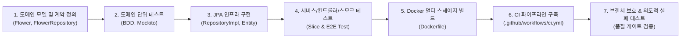

# 📚 [TIL] GitHub Actions CI 파이프라인 구축과 자동화 테스트

> **일시**: 2026년 9월 17일  
> **주제**: Spring Boot 클린 아키텍처 계층별 테스트 작성, GitHub Actions CI 파이프라인 구축, Docker 멀티 스테이지 빌드 및 GHCR 배포, 브랜치 보호 규칙(Branch Protection Rules)을 통한 품질 게이트 실습  
> **실습 저장소**: [pjmoo/260917_spring-test-ci](https://github.com/pjmoo/260917_spring-test-ci)

---

## 📌 목차
1. [오늘의 실습 흐름 (실제 진행 과정)](#1-오늘의-실습-흐름-실제-진행-과정)
2. [프로젝트 구조 및 계층별 테스트 설계](#2-프로젝트-구조-및-계층별-테스트-설계)
3. [핵심 개념 및 이론 정리 (교재 내용)](#3-핵심-개념-및-이론-정리-교재-내용)
   - [품질 검증 체계의 3단계](#-품질-검증-체계의-3단계)
   - [CI(지속적 통합)의 3대 기둥](#-ci지속적-통합의-3대-기둥)
   - [테스트 피라미드와 테스트 유형](#-테스트-피라미드와-테스트-유형)
   - [TDD vs BDD](#-tdd-vs-bdd)
   - [프로세스 종료 코드(Exit Code)와 Fail-Fast 원칙](#-프로세스-종료-코드exit-code와-fail-fast-원칙)
   - [GitHub Actions 워크플로우 구성 요소](#-github-actions-워크플로우-구성-요소)
   - [브랜치 보호 규칙과 품질 게이트](#-브랜치-보호-규칙과-품질-게이트)
   - [Docker 멀티 스테이지 빌드 & GHCR](#-docker-멀티-스테이지-빌드--ghcr)

---

## 1. 오늘의 실습 흐름 (실제 진행 과정)

오늘 실습은 단순한 코드 작성을 넘어, **로컬 도메인 설계부터 시작해 GitHub Actions CI 파이프라인 및 컨테이너 레지스트리 자동 배포까지 점진적으로 구축하는 실무 워크플로우**를 단계별로 체득했습니다.



### 🕒 시간대별 실습 단계 요약

1. **도메인 모델 및 리포지토리 인터페이스 정의 (`domain`)**
   - 불변 객체 `record Flower` 정의
   - 순수 도메인 포트 인터페이스 `FlowerRepository` 선언 (`count()`, `save()`, `findAll()`)
   - BDD Mockito 기반의 단위 테스트 `FlowerRepositoryTest` 작성 (도메인 계약 검증)

2. **인프라 계층 구현 (`infra`)**
   - Spring Data JPA 엔티티 `FlowerJpaEntity` 및 `FlowerJpaRepository` 작성
   - 도메인 인터페이스를 구현하는 `FlowerRepositoryImpl` 구현체 작성
   - 인프라 계층 단위 테스트 `FlowerRepositoryImplTest` 작성

3. **애플리케이션(서비스) 및 UI(웹) 계층 완성 (`app`, `ui`)**
   - `FlowerUseCase` 인터페이스 및 `FlowerService` 구현체 작성
   - 서비스 단위 테스트 `FlowerServiceTest` 및 스프링 통합 테스트 `FlowerServiceIntegrationTest` 작성
   - REST API `FlowerApiController`와 `FlowerDto` 작성
   - `@WebMvcTest` 기반 슬라이스 테스트 `FlowerApiControllerTest` 작성
   - Controller부터 H2 DB까지 전 구간을 검증하는 E2E `FlowerApiSmokeTest` 작성

4. **Docker 멀티 스테이지 빌드 작성 (`Dockerfile`)**
   - **1단계 (Builder)**: `gradle:jdk17` 이미지를 이용해 의존성 캐싱 후 `gradle bootJar` 실행
   - **2단계 (Runner)**: 가벼운 `azul/zulu-openjdk-alpine:17-jre-headless-latest`를 베이스로 빌드 산출물 `app.jar`만 복사하여 최종 컨테이너 경량화

5. **GitHub Actions CI 워크플로우 점진적 고도화 (`.github/workflows/ci.yml`)**
   - **Step 1: 기본 검증**: `push` 감지 및 `echo "hello ci!"` 잡 구성
   - **Step 2: 자동화 테스트**: `test` 잡 추가 (`checkout@v7`, `setup-java@v6` Temurin 17, `gradlew test` 실행)
   - **Step 3: 아티팩트 업로드**: `actions/upload-artifact@v7`을 활용해 테스트 실패/성공 여부와 무관하게(`if: always()`) HTML 테스트 리포트 보관
   - **Step 4: GHCR 컨테이너 이미지 빌드 & 배포**: `build` 잡 추가 (`needs: test`, QEMU, Buildx, `ghcr.io` 멀티 아키텍처 `linux/amd64`, `linux/arm64` 빌드/푸시)
   - **Step 5: PR 트리거 및 불필요한 빌드 스킵**: `pull_request` 트리거 추가, `paths-ignore: ['**.md', '.github/workflows/**']` 설정, PR 단계에서는 이미지 빌드 스킵(`if: github.event_name == 'push'`)

6. **브랜치 보호 규칙(Branch Protection)과 의도적 실패 테스트 실습**
   - `dev` 브랜치 분기 후 의도적으로 실패하는 단위 테스트 `FlowerServiceFailingTest` 작성 (`assertThat(count).isEqualTo(999L)`)
   - GitHub에서 `dev` → `main` Pull Request 생성
   - **결과**: GitHub Actions의 `Run Gradle tests`가 실패(Exit Code 1 반환)하고, 필수 상태 검사(Required Status Check) 미충족으로 인해 **Merge 버튼이 자동으로 비활성화(Blocked)** 되는 품질 게이트를 직접 확인!

---

## 2. 프로젝트 구조 및 계층별 테스트 설계

```text
spring-test-ci/
├── .github/
│   └── workflows/
│       └── ci.yml                         # GitHub Actions CI/CD 파이프라인
├── src/
│   ├── main/
│   │   ├── java/org/example/springtestci/
│   │   │   ├── SpringTestCiApplication.java
│   │   │   ├── app/                       # 애플리케이션 계층 (Use Case & Service)
│   │   │   │   ├── FlowerService.java
│   │   │   │   └── FlowerUseCase.java
│   │   │   ├── domain/                    # 도메인 계층 (Entity & Domain Repository)
│   │   │   │   ├── Flower.java
│   │   │   │   └── FlowerRepository.java
│   │   │   ├── infra/                     # 인프라 계층 (JPA Entity & Implementation)
│   │   │   │   ├── FlowerJpaEntity.java
│   │   │   │   ├── FlowerJpaRepository.java
│   │   │   │   └── FlowerRepositoryImpl.java
│   │   │   └── ui/                        # 웹 계층 (REST Controller & DTO)
│   │   │       ├── FlowerApiController.java
│   │   │       └── FlowerDto.java
│   │   └── resources/
│   │       └── application.yaml
│   └── test/                              # 계층별 테스트 코드 자산
│       └── java/org/example/springtestci/
│           ├── FlowerApiSmokeTest.java    # E2E 스모크 테스트 (전 구간 통합)
│           ├── app/
│           │   ├── FlowerServiceTest.java # 서비스 계층 단위 테스트 (Mockito)
│           │   ├── FlowerServiceIntegrationTest.java # 스프링 부트 통합 테스트
│           │   └── FlowerServiceFailingTest.java     # [실습용] 의도적 실패 유도 테스트
│           ├── domain/
│           │   └── FlowerRepositoryTest.java         # 도메인 계약 단위 테스트
│           ├── infra/
│           │   └── FlowerRepositoryImplTest.java     # JPA 구현체 단위 테스트
│           └── ui/
│               └── FlowerApiControllerTest.java      # 웹 슬라이스 테스트 (@WebMvcTest)
├── Dockerfile                             # 멀티 스테이지 컨테이너 빌드 파일
├── build.gradle                           # 의존성 및 빌드 설정
└── settings.gradle
```

---

## 3. 핵심 개념 및 이론 정리 (교재 내용)

### 📊 품질 검증 체계의 3단계
| 구분 | 1단계: 수동 API 검증 | 2단계: 런타임 관측과 경보 | 3단계: 사전 자동화 검증 (CI) |
| :--- | :--- | :--- | :--- |
| **검증 시점** | 로컬에서 기능 개발 후 수동 호출 시 | 배포 후 운영 환경 실행 중 | **커밋 푸시 후 브랜치 병합(Merge) 전** |
| **수행 주체** | 사람 (Postman, 브라우저 클릭) | Prometheus, Loki, Grafana 등 관측 스택 | **격리된 클라우드 러너 (Ubuntu)** |
| **검증 대상** | 단일 엔드포인트 응답 확인 | 자원 사용률, 에러율, 트래픽 | **비즈니스 로직, 계약, 기대값 (Assertion)** |
| **결함 발견 비용** | 큼 (릴리스 직전 발견) | **매우 큼 (실제 사용자에게 장애 노출)** | **가장 낮음 (수 분 내 피드백 수신)** |

> **핵심 원칙**: 관측 스택(Prometheus/Grafana)은 장애를 인지하고 추적하는 도구이지 결함의 유입을 막는 도구가 아닙니다. **결함 유입 차단은 반드시 병합(Merge) 이전 단계에서만 가능합니다.**

---

### 🏛️ CI(지속적 통합)의 3대 기둥
1. **단일 소스 저장소**: 팀 전체가 신뢰하는 기준 브랜치(`main`) 하나를 공유하고 보호 규칙을 적용합니다.
2. **빌드와 테스트 자동화**: 커밋마다 사람의 개입 없이 격리된 러너가 항상 동일한 빌드/검증 절차를 수행합니다.
3. **조기 실패와 즉각 피드백 (Fail-Fast)**: 결함이 발생하면 즉시 파이프라인을 중단하고 원인을 알려 결함 발견 시점을 최대한 앞당깁니다.

---

### 🔺 테스트 피라미드와 테스트 유형

```text
       / \
      /   \      E2E / 스모크 테스트 (수 분 이상, 실제 DB/API 연동, 작성/유지비용 큼)
     /     \
    /-------\    통합 / 슬라이스 테스트 (수 초, @WebMvcTest, 계층 연동 검증)
   /         \
  /-----------\  단위(Unit) 테스트 (수 밀리초, Mock 기반 100% 격리, 작성/유지비용 낮음)
```

- **단위 테스트 (Unit Test - 수 밀리초)**:
  - 외부 의존성(DB, 네트워크)을 Mockito로 전면 격리하고 순수 비즈니스 로직만 초고속 검증
  - 예: `FlowerRepositoryTest`, `FlowerServiceTest`
- **슬라이스 테스트 (Slice Test - 수 초)**:
  - 특정 계층의 빈(Bean)만 선별 로딩하여 검증 (네트워크 포트 바인딩 없이 실행)
  - `@WebMvcTest` + `@MockitoBean` + `MockMvc`로 컨트롤러의 요청/응답 직렬화 검증
  - 예: `FlowerApiControllerTest`
- **통합 테스트 (Integration Test - 수 초)**:
  - `@SpringBootTest`를 이용해 실제 스프링 컨텍스트를 띄우고 계층 간 상호작용 검증
  - 예: `FlowerServiceIntegrationTest`
- **스모크 테스트 (Smoke Test - 수 초 ~ 수 분)**:
  - 배포나 컨테이너 기동 직후 핵심 기능과 헬스체크가 정상 동작하는지 최소한으로 검증하는 E2E 테스트
  - 예: `FlowerApiSmokeTest`

---

### 🔄 TDD vs BDD
- **TDD (Test-Driven Development, 테스트 주도 개발)**:
  - 개발자 관점 / 내부 설계와 코드 품질 중심
  - **Red** (실패하는 테스트 작성) → **Green** (통과하는 최소 코드 작성) → **Refactor** (가독성/중복 개선)
- **BDD (Behavior-Driven Development, 행위 주도 개발)**:
  - 비즈니스 요구사항 명세 중심
  - **Given** (테스트 사전 상태 및 조건) → **When** (검증 대상 동작 수행) → **Then** (기대 결과 및 상태 검증)

---

### ⚡ 프로세스 종료 코드(Exit Code)와 Fail-Fast 원칙
- CI 러너는 텍스트 로그의 문자열을 파싱해 성공 여부를 판단하지 않고, **프로세스의 종료 코드(Exit Code)** 로 판정합니다.
  - `0`: 정상 성공 → 다음 단계(Job/Step) 진행
  - `1 이상`: 비정상 실패 → **파이프라인 즉시 중단 (Fail-Fast)**
- `./gradlew test` 실행 시 테스트가 단 하나라도 실패하면 Gradle은 Exit Code `1`을 반환하므로 CI가 즉시 빨간색(FAILED)으로 중단됩니다.

---

### ⚙️ GitHub Actions 워크플로우 구성 요소 (`ci.yml`)

```yaml
name: CI

on:
  push:
    branches: [ main ]
    paths-ignore:
      - '**.md'                # 문서 변경 시 CI 스킵
      - '.github/workflows/**' # 워크플로우 변경 시 스킵
  pull_request:
    branches: [ main ]         # PR 생성/업데이트 시 자동 검증

jobs:
  test:
    runs-on: ubuntu-latest
    steps:
      - uses: actions/checkout@v7          # 소스 코드 체크아웃
      - uses: actions/setup-java@v6        # Adoptium Temurin JDK 17 설치 & 의존성 캐시
        with:
          java-version: '17'
          distribution: 'temurin'
      - run: chmod +x ./gradlew            # 래퍼 실행 권한 부여
      - run: ./gradlew test                # 전체 테스트 실행
      - uses: actions/upload-artifact@v7   # 테스트 실패 시에도 항상 HTML 리포트 업로드
        if: always()
        with:
          name: test-report
          path: build/reports/tests/test

  build:
    needs: test                            # test 잡 성공 시에만 실행 (DAG 의존성)
    if: github.event_name == 'push'        # PR에서는 이미지 푸시 생략, main 푸시 시에만 실행
    runs-on: ubuntu-latest
    permissions:
      contents: read
      packages: write                      # GHCR 이미지 업로드 권한
    steps:
      - uses: actions/checkout@v7
      - uses: docker/setup-qemu-action@v4   # 멀티 아키텍처 에뮬레이션
      - uses: docker/setup-buildx-action@v4 # Docker Buildx 설정
      - uses: docker/login-action@v4       # GHCR 로그인 (GITHUB_TOKEN 활용)
        with:
          registry: ghcr.io
          username: ${{ github.actor }}
          password: ${{ secrets.GITHUB_TOKEN }}
      - uses: docker/build-push-action@v7  # 멀티 플랫폼 이미지 빌드 및 푸시
        with:
          context: .
          platforms: linux/amd64,linux/arm64
          push: true
          tags: |
            ghcr.io/${{ github.repository }}:${{ github.sha }}
            ghcr.io/${{ github.repository }}:latest
```

---

### 🛡️ 브랜치 보호 규칙과 품질 게이트
GitHub 저장소 `Settings -> Branches`에서 `main` 브랜치 보호 규칙을 설정합니다:
1. **Require a pull request before merging**: `main` 브랜치에 직접 커밋 푸시 차단
2. **Require status checks to pass before merging**: CI 테스트 잡이 반드시 성공(Pass)해야만 머지 활성화
3. **Do not allow bypassing the above settings**: 저장소 관리자(Admin)도 규칙을 우회할 수 없도록 강제

> 💡 **효과**: 테스트가 깨진 결함 코드는 `Checks`에서 빨간색 X 표시와 함께 **[Merge pull request] 버튼이 비활성화**되어 결함이 `main`으로 유입되는 것을 원천 차단합니다.

---

### 🐳 Docker 멀티 스테이지 빌드 & GHCR
- **멀티 스테이지 빌드(Multi-Stage Build)**:
  - 빌드 환경(JDK, Gradle 등 무거운 도구)과 런타임 환경(JRE만 포함된 경량 이미지)을 분리하여 최종 컨테이너 이미지 크기를 대폭 축소하고 보안성을 향상시킵니다.
- **GHCR (GitHub Container Registry)**:
  - `ghcr.io`는 GitHub 내장 컨테이너 레지스트리로, `secrets.GITHUB_TOKEN`을 통해 별도의 외부 시크릿 발급 없이 권한을 부여받아 이미지를 배포할 수 있습니다.
