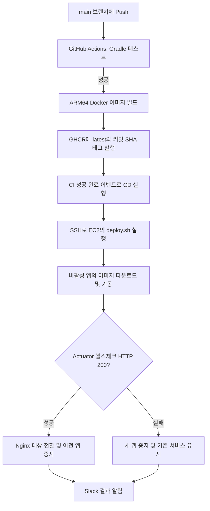
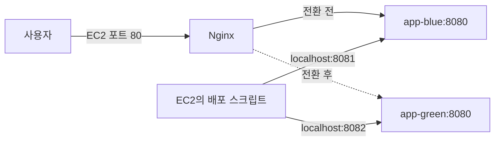

# [TIL] Spring Boot 테스트부터 AWS EC2 Blue/Green 자동 배포까지

> **실습 저장소:** [pjmoo/260918_ci-cd](https://github.com/pjmoo/260918_ci-cd)  
> **학습일: 2026.09.18**  
> **주제: GitHub Actions CI/CD, Docker, Nginx Blue/Green 배포, Slack 알림**

오늘은 꽃 정보를 저장하고 조회하는 Spring Boot 프로젝트를 바탕으로, **코드 검증 → 이미지 발행 → 서버 배포 → 결과 알림**으로 이어지는 자동화 흐름을 정리했다. 핵심은 새 버전을 실행한 뒤 정상 응답을 확인하고, 사용자 요청을 새 버전으로 넘기는 것이다.

이 문서는 현재 저장소의 코드와 수업 자료 **「09. AWS EC2 CD 파이프라인 구축과 배포 자동화」**를 기준으로 작성했다. 아래의 “구현 내용”은 파일에서 확인한 구성이며, 실제 Actions 실행 성공이나 EC2 배포 성공을 확인했다는 의미는 아니다. PDF에만 등장하는 내용은 보충 학습으로 구분했다.

## 1. 오늘의 학습 목표

- 계층별 테스트가 어떤 문제를 검증하는지 이해한다.
- 테스트를 통과한 코드만 Docker 이미지로 발행하도록 CI를 구성한다.
- CI 성공 후 EC2에서 배포 스크립트를 실행하도록 CD를 연결한다.
- Nginx와 두 개의 앱 컨테이너로 Blue/Green 전환 원리를 이해한다.
- 배포 성공·실패 결과를 Slack으로 전달하고 확인할 지점을 익힌다.

## 2. 전체 흐름 먼저 이해하기



쉽게 비유하면, **CI는 출고 전 검사**, **GHCR은 검사한 제품을 보관하는 창고**, **CD는 그 제품을 서비스 장소에 설치하는 과정**이다. Nginx는 사용자 요청을 현재 운영 중인 앱으로 안내한다.

### CI, Delivery, Deployment의 차이

| 용어 | 의미 | 이번 프로젝트와 연결 |
| --- | --- | --- |
| Continuous Integration, 지속적 통합 | 변경 코드를 통합하면서 빌드·테스트로 문제를 확인 | `./gradlew test`와 이미지 빌드 |
| Continuous Delivery, 지속적 제공 | 언제든 배포할 수 있게 준비하고 최종 반영에는 승인 절차를 둘 수 있음 | PDF에서 비교 학습 |
| Continuous Deployment, 지속적 배포 | 검증을 통과한 변경을 운영 환경까지 자동 반영 | CI 성공 후 SSH 배포 자동 실행 |

**PDF 보충 — 본문 4~6쪽:** Delivery와 Deployment를 구분하는 핵심은 최종 릴리스의 수동 승인 여부다. 배포는 프로그램을 서버에 설치하고 실행하는 작업이고, 릴리스는 기능을 사용자에게 공개하는 결정이다. 이번 설정에는 별도의 승인 단계가 없으며 수동 실행용 `workflow_dispatch`도 제공한다.

## 3. 실습 프로젝트 구조와 API

### 사용 기술

| 구분 | 저장소 설정 |
| --- | --- |
| 애플리케이션 | Java 17, Spring Boot 4.1.1, Gradle Wrapper |
| 웹·데이터 | Spring MVC, Spring Data JPA, H2, Lombok |
| 테스트 | JUnit, Mockito, AssertJ, MockMvc |
| 상태 확인 | Spring Boot Actuator |
| 빌드·배포 | GitHub Actions, Docker, GHCR, AWS EC2, Nginx |
| 알림 | Slack Incoming Webhook |

```text
.github/workflows/
  ci.yml                  # 테스트 → 이미지 빌드 및 발행
  cd.yml                  # SSH 배포 → Slack 알림
config/
  compose.yml             # Nginx, Blue, Green 컨테이너
  nginx.conf              # 사용자 요청을 앱으로 전달
  service-url.inc         # 현재 요청을 받을 앱 지정
  deploy.sh               # Blue/Green 전환 스크립트
src/main/java/org/example/springtestci/
  ui/                     # HTTP 요청·응답과 DTO 변환
  app/                    # 유스케이스와 서비스
  domain/                 # Flower와 저장소 인터페이스
  infra/                  # JPA 엔티티와 저장소 구현
src/main/resources/static/index.html  # 배포 변경 확인용 화면
src/test/                 # 단위·슬라이스·통합 테스트
Dockerfile                # 빌드용/실행용 이미지 분리
aws.sh                    # AWS 실습 환경변수와 리소스 조회
```

### 요청이 처리되는 순서

```text
클라이언트 → FlowerApiController → FlowerService
          → FlowerRepositoryImpl → FlowerJpaRepository → H2
```

컨트롤러는 `FlowerUseCase`, 서비스는 `FlowerRepository` 인터페이스에 의존한다. 덕분에 서비스 테스트에서는 실제 DB 대신 Mock 저장소를 넣어 서비스의 동작만 따로 확인할 수 있다.

`FlowerDto`는 HTTP 요청·응답용 데이터, `Flower`는 도메인 데이터, `FlowerJpaEntity`는 DB 저장용 객체다. 현재 필드가 비슷해도 각 계층의 역할을 나누기 위해 구분한다.

| 메서드 | 경로 | 역할 |
| --- | --- | --- |
| GET | `/` | 정적 HTML 화면 확인 |
| POST | `/api/flowers` | 꽃 저장 |
| GET | `/api/flowers` | 전체 꽃 목록 조회 |
| GET | `/api/flowers/count` | 저장된 꽃 개수 조회 |
| GET | `/actuator/health` | 배포 스크립트의 앱 상태 확인 |

꽃 저장 요청 예시:

```json
{"name":"장미","color":"빨강","price":5000}
```

## 4. 테스트: 무엇을 어디까지 확인했는가?

테스트는 모두 같은 범위를 검증하지 않는다. 작은 단위부터 실제 구성 요소를 함께 연결하는 테스트까지 나누어 확인한다.

| 테스트 파일 | 방식 | 확인하는 내용 |
| --- | --- | --- |
| `FlowerServiceTest` | Mock 저장소를 쓰는 단위 테스트 | 서비스의 저장소 호출과 반환값 |
| `FlowerApiControllerTest` | Mock 유스케이스 + standalone MockMvc | URL 매핑, HTTP 상태, JSON 응답 |
| `FlowerRepositoryTest` | 저장소 인터페이스를 Mock 처리 | Mock 설정과 호출 예시이며 실제 저장 기능은 검증하지 않음 |
| `FlowerRepositoryImplTest` | `@DataJpaTest` | 실제 JPA/H2를 사용하는 저장·조회와 객체 변환 |
| `FlowerServiceIntegrationTest` | `@SpringBootTest` | 서비스부터 실제 저장소까지의 연결 |
| `FlowerApiSmokeTest` | `@SpringBootTest` + MockMvc | API 저장 → 개수 조회 → 목록 조회의 전체 흐름 |
| `SpringTestCiApplicationTests` | `@SpringBootTest` | 애플리케이션 컨텍스트 로딩 |

`FlowerRepositoryImplTest`는 표시 이름에 “단위 테스트”가 있지만, 실제 구성은 JPA 슬라이스 테스트다. `FlowerApiSmokeTest`도 실제 빈과 DB를 연결하지만, MockMvc를 사용하므로 외부 서버에 네트워크 요청을 보내는 테스트는 아니다.

### Given / When / Then으로 읽기

```java
// Given: 저장소가 3을 반환하는 상황
given(flowerRepository.count()).willReturn(3L);

// When: 서비스에 꽃 개수 조회를 요청
long count = flowerService.count();

// Then: 결과가 3인지 확인
assertThat(count).isEqualTo(3L);
```

**배운 점:** Mock 테스트는 각 계층의 책임을 빠르게 확인하고, 통합 테스트는 실제 연결에서 발생하는 문제를 확인한다. Mock이 예상 값을 반환한다고 실제 DB 저장까지 정상이라는 뜻은 아니다.

## 5. CI: 테스트를 통과해야 이미지를 발행한다

관련 파일: [ci.yml](https://github.com/pjmoo/260918_ci-cd/blob/main/.github/workflows/ci.yml), [Dockerfile](https://github.com/pjmoo/260918_ci-cd/blob/main/Dockerfile)

1. `main`으로 Push하거나 `main` 대상 Pull Request를 만들면 CI가 실행된다.
2. JDK 17을 준비하고 Gradle Wrapper로 테스트를 실행한다.
3. 테스트 리포트를 `gradle-test-reports` 아티팩트로 업로드한다. `if: always()`로 테스트 실패 시에도 업로드를 시도한다.
4. `docker-build-push`는 `needs: test`를 사용하므로 테스트가 성공해야 실행된다.
5. 이미지 발행은 **main Push일 때만** 수행한다. 일반적인 PR 검증에서는 테스트만 실행한다.
6. GHCR에 `latest`와 커밋 SHA 두 가지 태그로 이미지를 올린다.

### 이미지 태그와 CPU 아키텍처

- `latest`: 현재 배포 스크립트가 가져오는 이동 가능한 태그다.
- 커밋 SHA: 어떤 소스 코드로 만든 이미지인지 식별하는 태그다.
- `linux/arm64`: 현재 이미지의 실행 대상 아키텍처다. CI 빌드 러너도 `ubuntu-24.04-arm`을 사용한다.

`aws.sh`는 Ubuntu 24.04 ARM64 AMI ID를 조회한다. 이미지와 서버의 CPU 아키텍처를 맞추는 구성이 연결되어 있다. GHCR 이미지 이름은 소문자로 변환하며, 발행에는 `GITHUB_TOKEN`과 `packages: write` 권한을 사용한다.

### Dockerfile을 두 단계로 나누는 이유

| 단계 | 하는 일 |
| --- | --- |
| 빌드 단계: `gradle:jdk17` | 소스를 복사하고 `gradle bootJar`로 JAR 생성 |
| 실행 단계: Java 17 JRE 이미지 | 생성된 JAR만 복사해 `java -jar app.jar` 실행 |

완성된 앱 실행에는 빌드 도구와 소스 전체가 필요하지 않으므로 빌드 환경과 실행 환경을 나눈다. Dockerfile의 `bootJar` 단계 자체가 테스트를 수행하는 것은 아니며, 테스트 통과 조건은 앞선 CI Job이 담당한다.

**PDF 보충 — 본문 23쪽:** 이미지 발행 전에 테스트 Job을 두고 `needs`로 연결하는 것이 테스트 게이트다. 테스트 자동화가 배포 자동화의 앞단에서 불완전한 변경을 차단한다.

## 6. CD: CI 완료 이벤트를 배포로 연결한다

관련 파일: [cd.yml](https://github.com/pjmoo/260918_ci-cd/blob/main/.github/workflows/cd.yml), [aws.sh](https://github.com/pjmoo/260918_ci-cd/blob/main/aws.sh)

`workflow_run`은 `Continuous Integration & Package` 워크플로가 완료되었을 때 후속 작업을 실행한다. **완료에는 실패도 포함되므로** Job 조건에서 `conclusion == 'success'`를 확인한다.

`workflow_dispatch`로 수동 실행할 수도 있다. 이 경우 새로운 CI 성공을 기다리는 조건을 우회하며, EC2는 Compose에 지정된 `latest` 이미지를 가져온다. 수동 실행에서 선택한 커밋을 직접 빌드하거나 해당 SHA 이미지로 배포하는 구성은 아니다.

### 필요한 GitHub Secrets

| 이름 | 용도 |
| --- | --- |
| `EC2_HOST` | SSH로 접속할 EC2 주소 |
| `EC2_USER` | EC2 접속 계정. PDF의 Ubuntu 예시는 `ubuntu` |
| `EC2_SSH_KEY` | 접속용 개인 키 전문 |
| `SLACK_WEBHOOK_URL` | 배포 결과를 보낼 Slack Webhook URL |

SSH 단계는 `appleboy/ssh-action`으로 EC2에 접속해 `~/deploy.sh`를 실행한다. CD 러너가 앱을 다시 빌드하는 것이 아니라, **EC2가 CI에서 발행한 이미지를 내려받아 실행**한다.

현재 CD에는 `config/` 파일을 EC2로 복사하는 단계가 없다. 따라서 EC2 사용자 홈에 `deploy.sh`, `compose.yml`, `nginx.conf`, `service-url.inc`가 미리 준비되어 있어야 한다. 스크립트 실행 권한과 Docker Compose, 이미지 접근 권한도 필요하다. GHCR 이미지가 비공개라면 EC2에서 사용하는 Docker 실행 사용자에게 레지스트리 인증이 필요하다.

**PDF 보충 — 본문 13~16, 24~26쪽:** EC2를 중지 후 다시 시작하면 자동 할당 공인 IP가 바뀔 수 있어 `EC2_HOST`를 점검해야 한다. Actions 러너가 SSH로 접근할 수 있는 보안 그룹 규칙도 필요하다. PDF의 SSH 전체 개방 예시는 실습용 임시 조치이며, 자료에서는 종료 후 해당 규칙 회수와 SSM·내부 러너 방식도 설명한다.

## 7. 핵심 실습: Nginx Blue/Green 배포

관련 파일: [compose.yml](https://github.com/pjmoo/260918_ci-cd/blob/main/config/compose.yml), [nginx.conf](https://github.com/pjmoo/260918_ci-cd/blob/main/config/nginx.conf), [service-url.inc](https://github.com/pjmoo/260918_ci-cd/blob/main/config/service-url.inc), [deploy.sh](https://github.com/pjmoo/260918_ci-cd/blob/main/config/deploy.sh)

Blue와 Green은 서로 다른 제품이 아니라 **같은 앱을 실행할 두 개의 자리**다. Blue가 요청을 처리하는 동안 Green에 새 버전을 준비하고, 준비가 끝나면 요청을 Green으로 돌린다. 다음 배포에서는 역할이 반대가 된다.



### 헷갈렸던 포트 정리

| 서비스 | 호스트 포트 → 컨테이너 포트 | 용도 |
| --- | --- | --- |
| Nginx | `80 → 80` | 사용자 요청 진입점 |
| Blue | `8081 → 8080` | EC2에서 Blue 직접 확인 |
| Green | `8082 → 8080` | EC2에서 Green 직접 확인 |

두 앱 모두 컨테이너 내부에서는 8080을 사용한다. 호스트에서 접근할 때는 8081과 8082로 구분한다. Nginx는 같은 `frontend-net` 안에서 `app-blue:8080` 같은 서비스 이름과 내부 포트로 접근한다.

### Nginx 설정을 두 파일로 나눈 이유

`nginx.conf`는 요청 전달에 필요한 공통 설정을 두고, 다음 파일을 읽는다.

```nginx
include /etc/nginx/conf.d/service-url.inc;
```

`service-url.inc`에는 현재 요청을 받을 대상 한 줄만 둔다.

```nginx
proxy_pass http://app-blue:8080;
```

배포할 때 이 대상을 Green으로 바꾸고 Nginx를 reload한다. Compose의 `:ro`는 컨테이너에서 마운트한 파일을 읽기 전용으로 사용한다는 뜻이다. 호스트의 배포 스크립트는 원본 파일을 수정할 수 있다.

### deploy.sh를 순서대로 읽기

1. `service-url.inc`를 읽어 현재 활성 서비스를 판단한다. 파일이 없으면 Blue를 기본값으로 만든다.
2. 반대편 서비스를 신규 배포 대상으로 선택한다.
3. 대상 서비스 이미지만 `docker compose pull`로 내려받는다.
4. `docker compose up -d`로 대상 컨테이너를 실행한다.
5. 대상 호스트 포트의 `/actuator/health`를 최대 10회 확인하고, 실패한 시도 뒤에는 3초 대기한다.
6. HTTP 200을 받지 못하면 **새 컨테이너만 중지하고 종료 코드 1로 실패 처리**한다. 프록시는 기존 앱을 계속 가리킨다.
7. 성공하면 `service-url.inc`를 새 앱으로 변경하고 `nginx -s reload`를 실행한다.
8. 이전 앱을 중지하고 `docker image prune -f`로 dangling 이미지를 정리한다.

현재 `curl`에는 요청 시간 제한이 없어 전체 헬스체크 시간이 정확히 30초로 제한되지는 않는다.

**PDF 보충 — 본문 8~10, 17~22쪽:** 컨테이너가 실행 중이라는 사실만으로 요청 처리가 가능하다고 판단할 수 없다. 그래서 실제 HTTP 응답을 확인하는 L7 헬스체크를 사용한다. PDF 예제는 `/`를 확인하지만, 이 프로젝트는 `/actuator/health`를 확인한다.

Nginx의 reload는 설정을 다시 읽고 새 워커로 전환하는 방식이다. 다만 현재 스크립트는 reload 직후 구버전 앱을 중지하므로, 오래 처리되는 요청까지 포함해 무중단을 보장한다고 단정할 수는 없다. 실제 요청을 보내며 오류와 연결 끊김 여부를 확인해야 한다.

## 8. Slack 알림: 배포 결과를 바로 확인하기

관련 파일: [cd.yml](https://github.com/pjmoo/260918_ci-cd/blob/main/.github/workflows/cd.yml)

- SSH 단계에 `id: ssh_deploy`를 붙이고 `steps.ssh_deploy.outcome`으로 결과를 확인한다.
- 알림 단계의 `if: always()`는 앞선 배포 단계가 실패해도 알림 전송을 시도하도록 한다.
- 성공은 초록색, 실패는 빨간색 카드로 구분한다.
- 저장소, 브랜치, 실행자, 커밋 SHA를 함께 보낸다.
- 자동 실행에서는 선행 CI의 `head_branch`, `head_sha`를 사용하고, 수동 실행에서는 현재 실행 컨텍스트의 값을 사용한다.
- `curl --fail-with-body`로 Slack의 HTTP 오류도 실패로 감지한다.

**PDF 보충 — 본문 32~35쪽:** Incoming Webhook은 지정된 URL에 JSON을 POST해 채널에 메시지를 보내는 방식이다. URL 자체가 메시지 전송 권한을 가지므로 Secrets로 관리한다.

**구현을 읽을 때 주의할 점:** 현재 실패 메시지는 “롤백되었습니다”라고 표시하지만, SSH 접속 실패나 Nginx 전환 이후 실패까지 실제 복구되었음을 확인하는 로직은 없다. 메시지만으로 복구를 판단하지 않고 배포 로그와 현재 프록시 대상을 확인해야 한다. CI 실패로 배포 Job 자체가 건너뛰어진 경우에도 이 Job 안의 Slack 단계는 실행되지 않는다.

## 9. PDF 보충 학습: Push와 Pull 배포

현재 저장소의 배포 설정은 **GitHub Actions → SSH → EC2**의 Push 방식이다. 커밋 기록에는 Watchtower 테스트용 화면 변경이 있지만, 현재 Compose에는 Watchtower 서비스가 정의되어 있지 않다.

| 구분 | Push: 이번 SSH 방식 | Pull: PDF의 Watchtower 방식 |
| --- | --- | --- |
| 배포 제어 주체 | 외부 Actions 러너 | EC2 내부의 에이전트 |
| 시작 방법 | 러너가 배포 명령 전달 | 에이전트가 이미지 변경 확인 |
| 주요 확인 위치 | Actions 로그와 배포 스크립트 출력 | Watchtower 로그 |
| 서버 접근 | SSH 접속 경로 필요 | 폴링은 외부 배포 요청용 인바운드 불필요 |

### Polling과 Webhook

**PDF 본문 7, 28~31쪽:** Watchtower 폴링 예제는 30초마다 이미지 다이제스트를 확인한다. 태그가 계속 `latest`여도 이미지 내용이 달라졌는지 다이제스트로 구분할 수 있다.

- **Polling:** “새 버전이 있나요?”를 일정 주기로 묻는다. 변경이 없어도 조회가 발생하고 반영까지 기다릴 수 있다.
- **Webhook 방식:** HTTP 업데이트 엔드포인트를 호출하면 이미지 확인·갱신을 시작한다. 외부에서 호출하려면 수신 경로와 토큰 인증이 필요하다.

Watchtower가 실행 중인 단일 컨테이너를 중지·재생성하는 동작은 이번 Blue/Green 전환과 다르며, 그 자체로 무중단을 보장하지 않는다. PDF에서는 Pull 방식 실습 후 Watchtower를 정리해 Push 배포로 복귀한다. 같은 컨테이너를 두 배포 도구가 동시에 변경하면 전환 상태가 어긋날 수 있기 때문이다.

## 10. 직접 실행하고 확인하는 방법

아래는 복습용 명령이다. 이 문서 작성 과정에서 테스트나 원격 배포를 실행한 것은 아니다.

### 로컬 Windows PowerShell

JDK 17을 준비하고 프로젝트 루트에서 실행한다.

```powershell
# 전체 테스트
.\gradlew.bat test

# 애플리케이션 실행
.\gradlew.bat bootRun
```

다른 터미널에서 확인한다.

```powershell
curl.exe http://localhost:8080/
curl.exe http://localhost:8080/actuator/health
curl.exe http://localhost:8080/api/flowers/count
```

테스트 HTML 리포트 위치는 `build/reports/tests/test/index.html`이다. Git Bash나 Linux에서는 `./gradlew test`, `./gradlew bootRun`을 사용한다. `aws.sh`는 Bash 문법이며 환경변수를 현재 셸에 적용하려면 Git Bash에서 `source ./aws.sh`로 읽는다. 이 파일 자체가 EC2를 생성하거나 시작하지는 않는다.

### EC2에서 배포 상태 확인

앞에서 설명한 파일과 권한을 사용자 홈에 준비한 상태에서 실행한다.

```bash
cd ~

# 최초 구성 시 Blue와 Nginx 실행
sudo docker compose up -d app-blue nginx

# 현재 프록시 대상과 컨테이너 상태 확인
cat ~/service-url.inc
sudo docker compose ps -a

# 사용자 진입점으로 앱 상태 확인
curl -i http://localhost/actuator/health

# 앱 로그 확인: 조사할 서비스 이름 지정
sudo docker compose logs --tail 100 app-blue
```

`~/deploy.sh`를 수동 실행하면 실제 반대편 앱으로 전환한다. 자동화 연결 전에 수동 실행 결과를 확인하면 스크립트 문제와 Actions 연결 문제를 구분하기 쉽다.

### 배포 중 응답 확인

**PDF 본문 36~38쪽**의 관찰 방법을 현재 프로젝트에 적용하면, `static/index.html` 문구를 바꿔 새 버전을 구분하고 별도 Git Bash 터미널에서 응답을 반복 확인할 수 있다.

```bash
export PUBLIC_IP="실제_EC2_공인_IP"
while true; do
  curl -sS --max-time 5 -w ' | HTTP %{http_code}\n' "http://$PUBLIC_IP/"
  sleep 0.5
done
```

확인 기준은 다음과 같다. 관찰은 `Ctrl+C`로 종료한다.

- CI 테스트 성공 후 이미지가 발행되는가?
- 새 앱 준비 중에도 기존 화면이 응답하는가?
- 전환 전후에 연결 오류나 HTTP 502가 발생하지 않는가?
- `service-url.inc`가 새 서비스를 가리키는가?
- 새 앱은 실행되고 이전 앱은 중지되었는가?
- Slack 알림과 실제 Actions 결과가 일치하는가?

## 11. 헷갈린 부분과 다음 개선점

### 자동 배포와 무중단 배포는 다른 개념이다

자동 배포는 사람이 하던 배포 절차를 자동 실행하는 것이다. 무중단 배포는 그 과정에서 사용자 요청이 끊기지 않도록 하는 것이다. 이번 실습은 자동 실행에 더해 비활성 앱 기동, 헬스체크, Nginx 전환을 조합했다.

### 현재 실패 처리는 모든 상황을 복구하는 롤백이 아니다

헬스체크 실패 시에는 전환 전이므로 기존 앱을 유지할 수 있다. 하지만 설정 변경 이후의 실패를 되돌리거나, 전환 후 사용자 요청까지 검증하는 코드는 없다. 다음에는 설정 검증, 전환 후 응답 확인, 이전 설정 복구, 처리 중 요청의 종료 대기를 보완할 수 있다.

### latest와 알림의 SHA가 실제 배포 버전을 확정하지는 않는다

CI는 SHA 태그도 발행하지만 Compose는 `latest`를 사용한다. 여러 변경이 연달아 들어오면 CI 이벤트의 SHA와 EC2가 가져온 이미지가 달라질 수 있다. 다음에는 배포할 SHA 태그를 명시하고 배포 동시 실행을 제어하는 방법을 학습한다. Compose의 이미지 경로도 CI가 발행하는 저장소 경로와 일치해야 한다.

### 트래픽 전환과 데이터 유지는 별도로 생각해야 한다

현재는 H2 의존성을 사용하고 외부 DB나 영속 저장 경로를 설정하지 않았다. 기본 인메모리 H2 구성에서는 Blue와 Green이 데이터를 공유하지 않으며 재시작 시 데이터 유지도 기대할 수 없다. 화면이 정상 전환되어도 저장한 꽃 데이터가 그대로 이어진다는 뜻은 아니다.

**PDF 보충 — 본문 18쪽, 심화 6쪽:** PDF의 Compose 예제에는 DB 환경변수와 백엔드 네트워크가 있지만 현재 프로젝트에는 없다. 공유 DB로 확장할 때는 구버전도 사용하는 컬럼을 바로 삭제하지 않고, **컬럼 추가 → 데이터·앱 전환 → 구컬럼 제거**의 Expand and Contract 순서를 고려한다.

### 단일 EC2 Blue/Green은 서버 장애까지 막지는 못한다

현재 앱 메모리 제한은 각각 896M이고 Nginx는 64M이다. 전환 중에는 앱 두 개가 함께 실행되므로 운영체제와 기타 프로세스의 메모리도 고려해야 한다.

**PDF 보충 — 본문 10쪽, 심화 3~7쪽:** 단일 EC2에서는 호스트가 멈추면 두 앱 모두 영향을 받는다. 심화 자료는 다중 인스턴스와 ALB Target Group 전환, Rolling·Canary 배포, OIDC와 SSM을 통한 원격 명령 전달을 추가 학습 주제로 다룬다. 이는 현재 저장소에 구현된 기능은 아니다.

## 참고 자료

- 수업 PDF: **09_AWS_EC2_CD_파이프라인_구축과_배포_자동화.pdf**
- 페이지 표기는 PDF 슬라이드의 **본문 1~39쪽**, **심화 1~18쪽** 구분을 따른다.
- 개념과 배포 구조: 본문 4~10쪽
- EC2·Secrets·Nginx·배포 스크립트: 본문 13~22쪽
- CI/CD 연결과 Watchtower: 본문 23~31쪽
- Slack과 전환 검증: 본문 32~38쪽
- 실습 종료 후 임시 SSH 규칙 회수와 리소스 정리: 본문 39쪽
- 배포 전략·DB 변경·인증 방식 확장: 심화 3~7쪽

PDF는 현재 `.gitignore`에서 제외되므로 저장소를 복제한 환경에는 포함되지 않을 수 있다. 코드와 자료의 차이는 위 각 절에 함께 기록했다.
