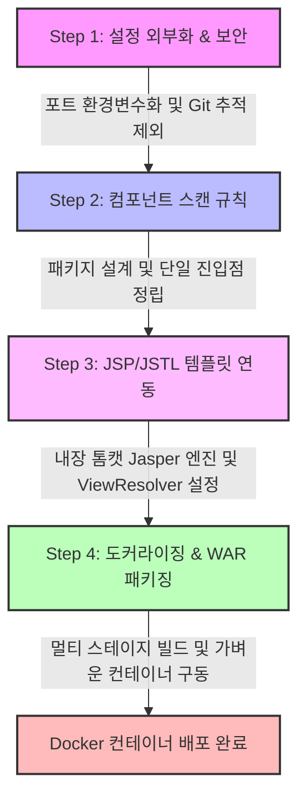

# 🚀 Boot Legacy 실습 프로젝트

스프링 부트(Spring Boot 3.x) 환경에서 레거시 기술 스펙(JSP, JSTL)을 수용하고, 설정 외부화 및 컨테이너 기반 배포(Docker Multi-stage Build)까지 점진적으로 고도화하는 학습용 저장소입니다.

---

## 🛠️ 기술 스택 (Tech Stack)

---

## 🗺️ 프로젝트 점진적 고도화 로드맵 (Roadmap)

---

## 📂 단계별 학습 문서 (Step-by-Step Guides)

각 브랜치와 실습 단계에 대한 세부 아키텍처 및 원리 분석은 아래의 개별 문서에서 확인할 수 있습니다.

### 🔌 [Step 1: 설정 외부화 및 Git 보안 설정](file:///Users/morgan/Documents/workspace/boot-legacy/step1.md)
* **핵심 주제**: `server.port=${PORT:8080}` 동적 환경 변수 주입 및 `.gitignore`를 통한 환경 변수 설정 파일(`.env`) 보안 관리.
* **관련 기술**:
  
  

### 🕵️‍♂️ [Step 2: 컴포넌트 스캔 및 패키지 레이아웃](file:///Users/morgan/Documents/workspace/boot-legacy/step2.md)
* **핵심 주제**: `@SpringBootApplication` 어노테이션의 패키지 루트 위치 중요성 및 스프링 빈(Bean) 스캔 탐색 범위 오류 분석.
* **관련 기술**:
  
  

### 🧪 [Step 3: 레거시 JSP/JSTL 연동](file:///Users/morgan/Documents/workspace/boot-legacy/step3.md)
* **핵심 주제**: 내장 톰캣(`tomcat-embed-jasper`) 환경에서 JSP 파일 분석 메커니즘 구축 및 Jakarta EE 10 스펙 하의 JSTL API/구현체 이중 의존성 설정.
* **관련 기술**:
  
  
  

### 🍱 [Step 4: Docker 멀티 스테이지 빌드 및 WAR 패키징](file:///Users/morgan/Documents/workspace/boot-legacy/step4.md)
* **핵심 주제**: JSP 리소스의 가상 디렉토리 규격 유지를 위한 `WAR` 패키징(`Executable WAR`) 채택, 빌드/런타임 레이어를 분리하는 Docker 멀티 스테이지 빌드 도입 및 중복 진입점(`@SpringBootApplication`) 제거.
* **관련 기술**:
  
  
  

<!-- pdf-til-supplement:start -->
## TIL 부연 설명 — PDF와 연결하기

기존 실습 내용을 이해하기 위한 PDF 기반 부연 설명이다. 아래 예시는 개념을 설명하기 위한 것이며, 이 프로젝트에서 실행해 관찰한 결과와는 구분한다. 페이지 번호는 표지를 포함한 PDF 순서다.

함께 읽을 파일: [src/main/java/org/example/bootlegacy/BootLegacyApplication.java](<../../boot-legacy/src/main/java/org/example/bootlegacy/BootLegacyApplication.java>) · [src/main/java/org/example/bootlegacy/step2/app/EntryApplication.java](<../../boot-legacy/src/main/java/org/example/bootlegacy/step2/app/EntryApplication.java>) · [src/main/java/org/example/bootlegacy/step2/ScanController.java](<../../boot-legacy/src/main/java/org/example/bootlegacy/step2/ScanController.java>)

### 자동 구성의 조건과 직접 작성하는 코드

Spring Boot는 스타터로 관련 의존성을 묶고 클래스패스·빈·설정 조건에 따라 구성을 제공한다. 업무 기능을 자동으로 작성하는 것은 아니며 Controller·Service·Repository는 여전히 애플리케이션의 책임이다. 자동 구성이 적용되지 않을 때는 의존성과 스캔 범위, 조건을 함께 확인한다.

**예시로 이해하기:** 메인 클래스의 패키지 밖에 컴포넌트를 두면 기본 스캔에서 놓칠 수 있다. 같은 소스를 개발·운영 환경에서 실행할 때는 코드 복사보다 외부 설정을 사용해 포트·DB 연결 정보를 바꾼다. 교안의 버전 표와 현재 프로젝트의 빌드 선언은 구분해서 읽는다.

근거: 241-3 Spring Boot — [15쪽](<../../260629_ex/새 폴더/7-8/241-3_Spring_Boot.pdf#page=15>) · [16쪽](<../../260629_ex/새 폴더/7-8/241-3_Spring_Boot.pdf#page=16>) · [17쪽](<../../260629_ex/새 폴더/7-8/241-3_Spring_Boot.pdf#page=17>) · [19쪽](<../../260629_ex/새 폴더/7-8/241-3_Spring_Boot.pdf#page=19>)

### 설정 파일의 값과 실제 적용값 구분하기

같은 설정 키가 여러 출처에 있으면 우선순위에 따라 최종 값이 정해진다. 프로파일은 환경별 설정을 선택하고 ConfigurationProperties는 관련 값을 타입으로 묶는다. 파일에 값이 적혀 있다는 사실만으로 그 값이 실행 시 사용된다고 판단하면 설정 오류를 놓칠 수 있다.

**예시로 이해하기:** 개발 포트를 바꿨는데 반영되지 않으면 활성 프로파일과 환경 변수·실행 인자를 함께 확인한다. .env 파일도 존재만으로 모든 실행 도구에 자동 적용되는 것은 아니므로 import나 로딩 구성을 읽는다. 비밀 값 자체보다 어떤 설정 키가 어디서 공급되는지를 TIL에 남긴다.

근거: 401-2 application-yml과 외부 설정 — [10쪽](<../../260629_ex/새 폴더/8-4/401-2_application-yml과_외부_설정.pdf#page=10>) · [13쪽](<../../260629_ex/새 폴더/8-4/401-2_application-yml과_외부_설정.pdf#page=13>) · [17쪽](<../../260629_ex/새 폴더/8-4/401-2_application-yml과_외부_설정.pdf#page=17>) · [28쪽](<../../260629_ex/새 폴더/8-4/401-2_application-yml과_외부_설정.pdf#page=28>) · [32쪽](<../../260629_ex/새 폴더/8-4/401-2_application-yml과_외부_설정.pdf#page=32>) · [34쪽](<../../260629_ex/새 폴더/8-4/401-2_application-yml과_외부_설정.pdf#page=34>)

### JSP는 전달받은 모델을 화면으로 바꾸는 계층

컨트롤러가 요청 검증과 서비스 호출을 맡고 JSP는 전달받은 모델을 표현하면 화면 수정과 업무 규칙 수정의 영향을 나눌 수 있다. EL은 모델 값을 읽고 JSTL은 조건·반복을 표현한다. 템플릿에서 직접 DB를 조회하면 이 경계가 무너진다.

**예시로 이해하기:** 도서 목록을 컨트롤러에서 request 속성으로 전달하고 JSP에서 반복 출력하는 흐름을 따라간다. WEB-INF 아래의 JSP로 forward하는 구성은 외부에서 화면 파일에 직접 접근하는 경로를 줄인다. 사용자 입력 출력에는 HTML 이스케이프가 적용되는 태그·방식을 사용한다.

근거: 231-3 JSP — [6쪽](<../../260629_ex/새 폴더/6-30/231-3_JSP.pdf#page=6>) · [7쪽](<../../260629_ex/새 폴더/6-30/231-3_JSP.pdf#page=7>) · [14쪽](<../../260629_ex/새 폴더/6-30/231-3_JSP.pdf#page=14>) · [18쪽](<../../260629_ex/새 폴더/6-30/231-3_JSP.pdf#page=18>)

<!-- pdf-til-supplement:end -->
