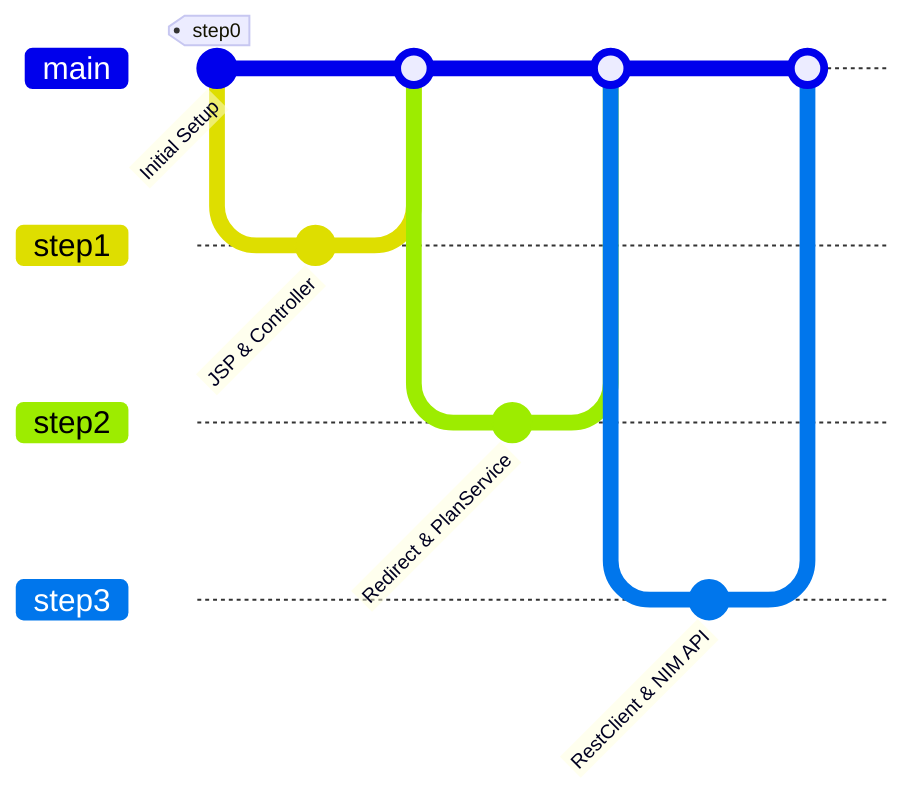

# NIM REST Client (AI 기반 학습 계획 생성 시스템)

Spring Boot 4와 Spring 7의 HTTP 클라이언트인 `RestClient`를 활용하여 NVIDIA NIM API(DeepSeek V4 Flash)와 연동하고, 사용자가 입력한 과목에 대한 2주 분량의 맞춤형 학습 계획을 자동 생성해주는 웹 애플리케이션입니다.

---

## 🛠️ Tech Stack & Badges


---

## 📂 Branch Roadmap & Architecture

본 프로젝트는 초보자가 점진적으로 학습할 수 있도록 단계별 브랜치 전략을 통해 단계적으로 구현되었습니다.



---

## 🌿 에센셜 요약 (Step-by-Step Summary)

각 단계별 핵심 내용 요약 및 상세 문서 링크입니다. (상세 링크에서 **초심자 비유**, **주니어용 원리/구조**, **면접 예상 질문**을 확인하실 수 있습니다.)

| 단계 | 브랜치 | 핵심 요약 | 상세 가이드 |
| :--- | :--- | :--- | :--- |
| **Step 0** | `step0` | Spring Boot 4 기초 빌드 환경 세팅 및 의존성 구성 | [상세 분석 문서 보기](./docs/step0.md) |
| **Step 1** | `step1` | JSP View Resolver 연동 및 Web MVC 기본 컨트롤러 매핑 | [상세 분석 문서 보기](./docs/step1.md) |
| **Step 2** | `step2` | POST 폼 추가, PRG(Post-Redirect-Get) 패턴 및 FlashAttributes 데이터 보존 적용 | [상세 분석 문서 보기](./docs/step2.md) |
| **Step 3** | `step3` | RestClient 설계 및 NVIDIA NIM API(DeepSeek V4) AI 실연동 | [상세 분석 문서 보기](./docs/step3.md) |

---

## 🏃 어떻게 실행하나요?

### 1. API 키 설정 (환경 변수)
NVIDIA NIM API를 사용하기 위해 [NVIDIA API Keys](https://build.nvidia.com/settings/api-keys)에서 발급받은 API 키를 로컬 시스템에 설정해야 합니다.

프로젝트 루트의 `.env` 파일에 발급받은 키를 작성해주세요. (또는 시스템 환경변수로 등록)
```bash
NIM_API_KEY=your_nvidia_nim_api_key_here
```

### 2. IntelliJ IDEA를 통한 실행
1. IntelliJ IDEA에서 본 프로젝트를 오픈합니다.
2. `src/main/java/org/example/nimrestclient/NimRestClientApplication.java` 메인 클래스로 이동합니다.
3. `main` 메서드 좌측의 초록색 실행 버튼(▶)을 클릭하여 **'Run 'NimRestClientApplication''**을 통해 실행합니다.
   > ⚠️ **환경변수 설정 주의**
   >
   > IntelliJ에서 애플리케이션을 구동하기 전, 반드시 상단 실행 구성 설정(**Run/Debug Configurations**)의 **Environment variables** 필드에 `NIM_API_KEY` 환경변수와 값을 추가하거나 `EnvFile` 플러그인을 활성화하여 API 키 값을 주입해야 에러 없이 정상 연동됩니다.
4. 구동 완료 후 브라우저에서 `http://localhost:8080`에 접속하여 학습 계획 생성을 테스트합니다.


<!-- pdf-til-supplement:start -->
## TIL 부연 설명 — PDF와 연결하기

기존 실습 내용을 이해하기 위한 PDF 기반 부연 설명이다. 아래 예시는 개념을 설명하기 위한 것이며, 이 프로젝트에서 실행해 관찰한 결과와는 구분한다. 페이지 번호는 표지를 포함한 PDF 순서다.

함께 읽을 파일: [src/main/java/org/example/nimrestclient/controller/PlanController.java](<../../nim-rest-client/src/main/java/org/example/nimrestclient/controller/PlanController.java>) · [src/main/java/org/example/nimrestclient/NimRestClientApplication.java](<../../nim-rest-client/src/main/java/org/example/nimrestclient/NimRestClientApplication.java>) · [src/main/java/org/example/nimrestclient/service/PlanService.java](<../../nim-rest-client/src/main/java/org/example/nimrestclient/service/PlanService.java>)

### HTTP 성공과 데이터 파싱 성공 구분하기

fetch의 첫 Promise는 Response를, response.json()의 Promise는 본문을 읽고 변환한 값을 제공한다. 서버가 404나 500을 응답해도 fetch 자체는 정상적으로 완료될 수 있으므로 response.ok 또는 status를 먼저 확인한다. 네트워크 실패, HTTP 오류, JSON 파싱 오류는 원인이 다르다.

**예시로 이해하기:** 목록 조회에서는 로딩 표시 → 응답 상태 확인 → JSON 변환 → 빈 목록 또는 카드 렌더링 순서로 분리한다. JSON 전송은 직렬화와 Content-Type을 맞추고, FormData 전송은 브라우저가 multipart boundary를 구성하도록 Content-Type을 직접 고정하지 않는다.

근거: 163-1 JavaScript Fetch — [11쪽](<../../260629_ex/새 폴더/6-1/163-1_JavaScript_Fetch.pdf#page=11>) · [12쪽](<../../260629_ex/새 폴더/6-1/163-1_JavaScript_Fetch.pdf#page=12>) · [23쪽](<../../260629_ex/새 폴더/6-1/163-1_JavaScript_Fetch.pdf#page=23>) · [25쪽](<../../260629_ex/새 폴더/6-1/163-1_JavaScript_Fetch.pdf#page=25>) · [28쪽](<../../260629_ex/새 폴더/6-1/163-1_JavaScript_Fetch.pdf#page=28>)

### AI 서비스의 입력·호출·출력 책임

ChatModel은 모델 통신 계약을, ChatClient는 프롬프트 구성과 호출을 편하게 연결하는 계층을 제공한다. 컨트롤러가 제공자 세부 설정까지 다루기보다 서비스에 입력을 넘기고 앱에 맞는 결과를 받으면 제공자 변경 영향을 줄일 수 있다.

**예시로 이해하기:** 영화 추천이라면 사용자 조건 → 추천 서비스 → 모델 응답 → 화면 DTO 순서로 읽는다. 제공자가 호환 API를 제공하더라도 지원 모델·옵션·구조화 출력까지 모두 같다고 가정하지 않는다. 교안 예제의 제공자 설정은 프로젝트에 선언된 의존성과 대조한다.

근거: 331-1 Spring AI 기초 — [32쪽](<../../260629_ex/새 폴더/7-27/331-1_Spring_AI_기초.pdf#page=32>) · [33쪽](<../../260629_ex/새 폴더/7-27/331-1_Spring_AI_기초.pdf#page=33>) · [36쪽](<../../260629_ex/새 폴더/7-27/331-1_Spring_AI_기초.pdf#page=36>) · [37쪽](<../../260629_ex/새 폴더/7-27/331-1_Spring_AI_기초.pdf#page=37>) · [41쪽](<../../260629_ex/새 폴더/7-27/331-1_Spring_AI_기초.pdf#page=41>)

<!-- pdf-til-supplement:end -->
