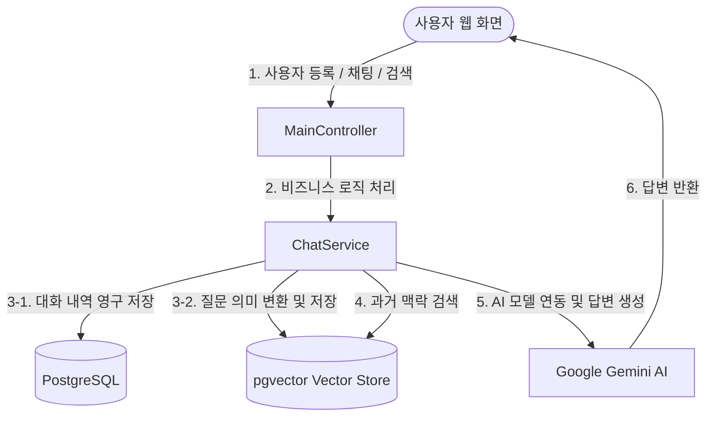

# 🧸 걱정인형 (Worrydoll) - Spring AI & RAG 실습 프로젝트

이 프로젝트는 **Spring Boot**와 **Spring AI**, 그리고 **PostgreSQL (pgvector)**을 활용하여 사용자의 대화 내용을 기억하고, 과거 대화에서 필요한 정보를 찾아 답변해 주는 AI 기반의 채팅 및 RAG(검색 증강 생성) 웹 서비스입니다. 

초보자분들도 쉽게 이해할 수 있도록 동작 원리와 설치 방법을 자세하게 설명합니다!

---

## 💡 주요 개념 눈높이 설명

AI 서비스를 처음 접하는 분들을 위해 핵심 기술을 쉽게 풀어 설명해 드릴게요.

### 1. Spring AI 🍃
* **설명**: 스프링(Spring) 프레임워크에서 OpenAI나 Google Gemini 같은 인공지능 모델을 편리하게 연동할 수 있도록 도와주는 도구입니다.
* **이 프로젝트에서의 역할**: Google의 **Gemini AI 모델**(`gemini-3.5-flash-lite`, `gemini-3.1-flash-lite`)과 대화하고 요청을 주고받는 창구 역할을 합니다.

### 2. Chat Memory (대화 메모리) 🧠
* **설명**: AI는 기본적으로 이전 질문을 기억하지 못합니다(State-less). 대화의 맥락을 기억하기 위해 이전 대화 기록들을 보관해 두었다가 다음 질문을 보낼 때 같이 묶어서 보내주는 기술입니다.
* **이 프로젝트에서의 역할**: 사용자가 대화방에서 계속해서 이야기를 나눌 때, AI가 이전 대화의 흐름을 기억한 채 자연스럽게 대답할 수 있도록 돕습니다. (데이터베이스에 대화 이력이 저장됩니다.)

### 3. Vector DB (벡터 데이터베이스) & 임베딩(Embedding) 🔍
* **설명**:
  * **임베딩**: 컴퓨터가 텍스트의 '의미'를 이해할 수 있도록 문장을 여러 개의 숫자(벡터)로 변환하는 기술입니다. 예를 들어 "배고프다"와 "밥 먹고 싶다"는 단어는 다르지만 의미가 유사하므로 비슷한 숫자로 변환됩니다.
  * **Vector DB**: 이 변환된 숫자들을 저장하고, 사용자가 질문을 던졌을 때 **의미상 가장 유사한 데이터를 빠르게 검색**해 주는 특수 데이터베이스입니다.
* **이 프로젝트에서의 역할**: 사용자가 입력한 모든 대화 내용을 벡터로 변환하여 **PostgreSQL의 pgvector 확장 프로그램**에 저장합니다.

### 4. RAG (Retrieval-Augmented Generation, 검색 증강 생성) 🚀
* **설명**: AI가 학습하지 않은 외부 정보(이 프로젝트에서는 사용자의 과거 대화 기록)를 검색하여 그 정보에 기반해 답변을 생성하는 기법입니다.
* **이 프로젝트에서의 역할**: 사용자가 과거 대화 내용에 대해 질문하면, 벡터 DB에서 해당 사용자의 과거 대화들을 검색(Retrieve)하고, 그 결과를 AI에게 참고 자료로 제공하여 정확한 답변을 유도합니다.

---

## 🛠️ 기술 스택 (Tech Stack)

* **Backend**: Java 17, Spring Boot 3.x, Spring AI
* **Database**: PostgreSQL (pgvector 확장 활성화 필요)
* **View**: JSP (JavaServer Pages)
* **AI Model**: Google Gemini (`gemini-3.5-flash-lite`, `gemini-3.1-flash-lite`)

---

## 🏗️ 시스템 아키텍처 및 동작 흐름



1. **대화(Chat) 흐름**: 
   * 사용자가 대화창에 메시지를 입력합니다.
   * `ChatClient`가 이전 대화 메모리를 장착하여 Gemini AI에 전달하고 답변을 받아옵니다.
   * 입력된 메시지는 나중에 검색할 수 있도록 벡터 변환(Embedding)을 거쳐 **Vector Store (pgvector)**에 저장됩니다.
2. **검색(Search/RAG) 흐름**:
   * 사용자가 검색창에 질문을 입력합니다.
   * 질문과 가장 의미가 유사한 과거 메시지들을 벡터 데이터베이스에서 찾아냅니다. (이때 로그인한 사용자의 대화만 매칭되도록 필터링 처리합니다.)
   * 찾아낸 대화 내역들을 Gemini AI에 컨텍스트로 제공하며: *"이 맥락 안에서만 대답하고, 모르는 정보라면 '정보가 없다'고 대답해줘"* 라는 시스템 프롬프트에 맞춰 정확히 필터링된 답변을 만들어냅니다.

---

## ⚙️ 실행 방법 (Getting Started)

프로젝트를 로컬에서 구동하기 위해 필요한 단계입니다.

### 1. 사전 준비 사항
* **Java 17** 이상이 설치되어 있어야 합니다.
* **Google Gemini API Key**가 필요합니다. [Google AI Studio](https://aistudio.google.com/)에서 무료로 발급받을 수 있습니다.
* **PostgreSQL**이 설치되어 있고, `pgvector` 확장이 활성화되어 있어야 합니다.

### 2. 환경 변수 설정
프로젝트 루트 디렉토리에 `.env.dev` 파일을 생성하여 다음과 같이 환경 변수를 입력해 줍니다. (`.env.dev.sample` 파일 참고)

```properties
# 데이터베이스 연결 정보
DB_URL=jdbc:postgresql://localhost:5432/worrydoll
DB_USERNAME=your_username
DB_PASSWORD=your_password

# Google Gemini API 키
GEMINI_API_KEY=your_gemini_api_key_here
```

### 3. 프로젝트 실행
터미널에서 아래 명령어를 실행하여 서비스를 구동합니다.

```bash
# Windows
./mvnw.cmd spring-boot:run

# Mac/Linux
./mvnw spring-boot:run
```
실행이 완료되면 브라우저에서 `http://localhost:8080`에 접속하여 사용할 수 있습니다.

---

## 📂 주요 코드 구조 및 설명

* [MainController.java](file:///C:/workspace/worrydoll/src/main/java/org/example/worrydoll/controller/MainController.java): 사용자의 HTTP 요청(대화 입력, 유저 세션 관리, RAG 검색 요청)을 가로채서 처리하는 컨트롤러입니다.
* [ChatService.java](file:///C:/workspace/worrydoll/src/main/java/org/example/worrydoll/service/ChatService.java): 대화 기록을 로드하고, 벡터 DB에 이력을 적재하며, RAG 검색을 수행하는 핵심 비즈니스 로직 클래스입니다.
* [AiConfig.java](file:///C:/workspace/worrydoll/src/main/java/org/example/worrydoll/config/AiConfig.java): Spring AI의 `ChatClient`와 `ChatMemory` 설정 및 RAG 검색 시 임계값(Similarity Threshold)과 시스템 프롬프트를 지정해 주는 구성(Configuration) 파일입니다.

<!-- pdf-til-supplement:start -->
## TIL 부연 설명 — PDF와 연결하기

기존 실습 내용을 이해하기 위한 PDF 기반 부연 설명이다. 아래 예시는 개념을 설명하기 위한 것이며, 이 프로젝트에서 실행해 관찰한 결과와는 구분한다. 페이지 번호는 표지를 포함한 PDF 순서다.

함께 읽을 파일: [src/main/java/org/example/worrydoll/controller/MainController.java](<../../worrydoll/src/main/java/org/example/worrydoll/controller/MainController.java>) · [src/main/java/org/example/worrydoll/WorrydollApplication.java](<../../worrydoll/src/main/java/org/example/worrydoll/WorrydollApplication.java>) · [src/main/java/org/example/worrydoll/repository/ChatMessageJpaRepository.java](<../../worrydoll/src/main/java/org/example/worrydoll/repository/ChatMessageJpaRepository.java>)

### 구조화 출력과 대화 메모리는 별도 문제

구조화 출력은 모델 응답을 앱에서 다루기 쉬운 타입으로 변환하는 과정이다. JSON으로 파싱되었다고 내용까지 맞는 것은 아니므로 필수 값과 범위를 검증해야 한다. 대화 메모리는 이전 메시지를 다시 실어 보내며 conversationId로 대화를 구분한다.

**예시로 이해하기:** 일정 결과의 날짜·장소 필드가 존재해도 실제로 가능한 일정인지는 별도 검증 대상이다. 대화 ID를 받는 API는 그 ID가 현재 사용자의 것인지 확인해야 한다. 메모리 저장소에 기록했다는 사실과 모델 요청에 이력이 포함되었다는 사실도 구분한다.

근거: 331-2 Spring AI 활용 — [11쪽](<../../260629_ex/새 폴더/7-28/331-2_Spring_AI_활용.pdf#page=11>) · [13쪽](<../../260629_ex/새 폴더/7-28/331-2_Spring_AI_활용.pdf#page=13>) · [27쪽](<../../260629_ex/새 폴더/7-28/331-2_Spring_AI_활용.pdf#page=27>) · [29쪽](<../../260629_ex/새 폴더/7-28/331-2_Spring_AI_활용.pdf#page=29>) · [33쪽](<../../260629_ex/새 폴더/7-28/331-2_Spring_AI_활용.pdf#page=33>)

### RAG의 검색 단계와 생성 단계

RAG는 문서를 조각으로 나누어 검색 가능하게 저장하고 질문과 관련된 조각을 찾아 답변의 근거로 전달한다. 생성 모델의 지식을 다시 학습시키는 과정과 다르다. 문서와 질문의 벡터는 같은 임베딩 공간에서 비교해야 하며 차원이 같다는 것만으로 서로 다른 모델의 벡터가 호환되지는 않는다.

**예시로 이해하기:** 답변이 틀리면 먼저 원하는 문서가 적재되었는지, 적절한 조각이 검색되었는지, 마지막으로 모델이 근거를 제대로 사용했는지 분리해 확인한다. top-k를 무조건 늘리면 관련 없는 정보도 늘어날 수 있으므로 검색 결과와 출처를 함께 관찰한다.

근거: 332-1 RAG와 VectorDB 기초 — [14쪽](<../../260629_ex/새 폴더/7-30/332-1_RAG와_VectorDB_기초.pdf#page=14>) · [19쪽](<../../260629_ex/새 폴더/7-30/332-1_RAG와_VectorDB_기초.pdf#page=19>) · [27쪽](<../../260629_ex/새 폴더/7-30/332-1_RAG와_VectorDB_기초.pdf#page=27>) · [37쪽](<../../260629_ex/새 폴더/7-30/332-1_RAG와_VectorDB_기초.pdf#page=37>) · [45쪽](<../../260629_ex/새 폴더/7-30/332-1_RAG와_VectorDB_기초.pdf#page=45>)

### 청크와 메타데이터가 답변 품질을 결정한다

Document는 본문뿐 아니라 식별자와 메타데이터를 갖는다. 청크가 너무 작으면 맥락을 잃고 너무 크면 검색에 불필요한 내용이 섞인다. 원문 파일·페이지·소유자 정보를 함께 저장하면 답변 출처를 표시하고 검색 대상을 제한할 수 있다.

**예시로 이해하기:** 사내 문서 검색에서는 사용자가 읽을 수 있는 문서만 검색 단계에서 걸러야 한다. 검색 후 화면에서 숨기는 것은 이미 모델에 전달된 정보의 노출을 막지 못한다. 같은 문서를 재업로드할 때 중복 적재와 기존 조각 갱신 방식도 정한다.

근거: 332-2 Spring Boot 기반 RAG 구현 — [9쪽](<../../260629_ex/새 폴더/7-30/332-2_Spring_Boot_기반_RAG_구현.pdf#page=9>) · [11쪽](<../../260629_ex/새 폴더/7-30/332-2_Spring_Boot_기반_RAG_구현.pdf#page=11>) · [25쪽](<../../260629_ex/새 폴더/7-30/332-2_Spring_Boot_기반_RAG_구현.pdf#page=25>) · [27쪽](<../../260629_ex/새 폴더/7-30/332-2_Spring_Boot_기반_RAG_구현.pdf#page=27>) · [30쪽](<../../260629_ex/새 폴더/7-30/332-2_Spring_Boot_기반_RAG_구현.pdf#page=30>) · [35쪽](<../../260629_ex/새 폴더/7-30/332-2_Spring_Boot_기반_RAG_구현.pdf#page=35>)

<!-- pdf-til-supplement:end -->
